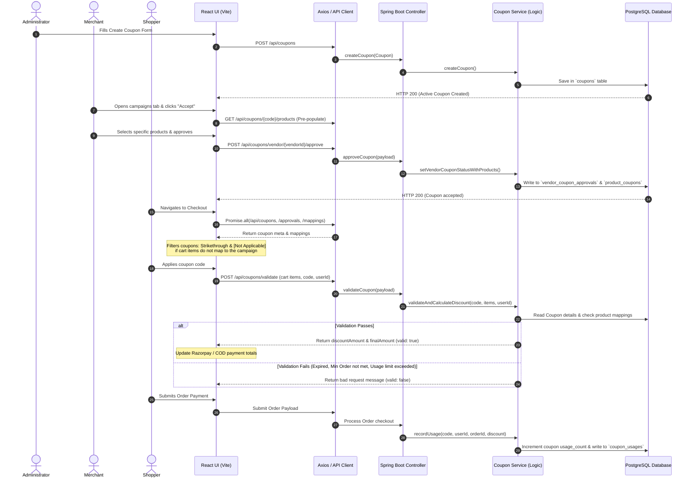
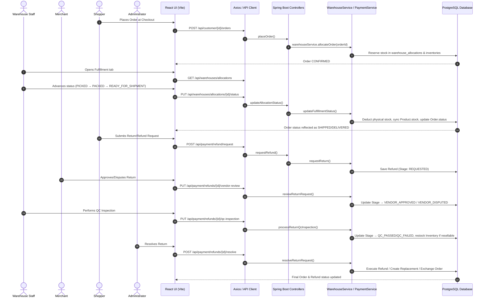

# ShopStack - Enterprise Multi-Vendor E-Commerce Platform

ShopStack is a full-stack, enterprise-grade multi-vendor e-commerce platform built with Spring Boot for the backend RESTful API services and React.js (Vite) for the frontend client layer.

---

## 🛠️ Tech Stack & Prerequisites

### Backend
* **Language:** Java 26
* **Framework:** Spring Boot 4.1.0
* **Security:** Spring Security & CORS Configuration
* **ORM / Database:** Spring Data JPA, Hibernate, PostgreSQL
* **Build Tool:** Apache Maven

### Frontend
* **Framework:** React.js (Bootstrapped with Vite)
* **HTTP Client:** Axios
* **Routing:** React Router DOM

### Tools & Testing
* **API Testing:** Postman
* **Database Client:** pgAdmin 4 / psql
* **Version Control:** Git & GitHub

---

## 📁 Project Architecture & Directory Structure

```text
ShopStack-Enterprise-Multi-Vendor-E-Commerce-Platform/
├── backend/
│   ├── src/
│   │   ├── main/
│   │   │   ├── java/com/shopstack/backend/
│   │   │   │   ├── config/
│   │   │   │   │   └── SecurityConfig.java      # Spring Security & Permissive CORS Config
│   │   │   │   ├── controller/
│   │   │   │   │   └── AuthController.java      # Authentication REST APIs (/api/auth)
│   │   │   │   ├── model/
│   │   │   │   │   └── User.java                # JPA Entity for User Account & Role Types
│   │   │   │   ├── repository/
│   │   │   │   │   └── UserRepository.java      # JPA Data Repository Interface
│   │   │   │   └── BackendApplication.java      # Main Application Entrypoint
│   │   │   └── resources/
│   │   │       └── application.properties       # DB Credentials & JPA Configurations
│   └── pom.xml
│
└── frontend/
    ├── src/
    │   ├── components/
    │   │   ├── Register.jsx                     # User Registration UI Component
    │   │   └── Login.jsx                        # User Authentication UI Component
    │   ├── App.jsx                              # Dynamic View State & Navigation Toggle
    │   └── main.jsx                             # React Application Entrypoint
    └── package.json

    🚀 Features Implemented (Day 1 Milestone)
[x] Database Setup: Initialized shopstack_db inside PostgreSQL server.

[x] Spring Boot Core: Initialized backend structure with Spring Data JPA and PostgreSQL database connection driver[cite: 1].

[x] User Entity Data Model: Created User schema containing id, fullName, email, password, and role (CUSTOMER / VENDOR)[cite: 1].

[x] Spring Security Configuration: Custom SecurityFilterChain permitting public CORS access to authentication endpoints (/api/auth/**)[cite: 1].

[x] RESTful API Endpoints:

POST /api/auth/register — Validates non-duplicate emails and registers new accounts[cite: 1].

POST /api/auth/login — Authenticates credentials and returns user details[cite: 1].

[x] React Frontend Setup: Created a Vite-powered React client connected to the backend via axios[cite: 1].

[x] API Testing: Endpoints successfully verified and tested using Postman.

⚙️ How to Run locally
1. Database Configuration
Ensure PostgreSQL is running locally on default port 5432 with a database named shopstack_db.

Update credentials in backend/src/main/resources/application.properties:

Properties
spring.datasource.url=jdbc:postgresql://localhost:5432/shopstack_db
spring.datasource.username=postgres
spring.datasource.password=YOUR_POSTGRES_PASSWORD

2. Running the Backend
Bash
cd backend
mvn clean compile
mvn spring-boot:run
The Spring Boot server will start on port 8080.

3. Running the Frontend
Bash
cd frontend
npm install
npm run dev
The Vite development client will start at http://localhost:5173/.

🧪 Postman Endpoint Testing
Register Endpoint (POST)
URL: http://localhost:8080/api/auth/register

Headers: Content-Type: application/json

Request Body:

JSON
{
  "fullName": "Test User",
  "email": "test@example.com",
  "password": "password123",
  "role": "CUSTOMER"
}
Success Response (200 OK): "User registered successfully!"

2. Login Endpoint (POST)
URL: http://localhost:8080/api/auth/login

Headers: Content-Type: application/json

Request Body:

JSON
{
  "email": "test@example.com",
  "password": "password123"
}
Success Response (200 OK):

JSON
{
  "id": 1,
  "fullName": "Test User",
  "email": "test@example.com",
  "password": "password123",
  "role": "CUSTOMER"
}
Error Response (401 Unauthorized): "Invalid email or password"

# 🛒 ShopStack — Day 2: Customer Module

This repository contains the implementation for **Day 2 (Customer Module)** of the ShopStack E-Commerce platform built with **Spring Boot** and **React (Vite)**.

---

## 📌 Day 2 Deliverables & Features

### 1. Customer Module
- [x] **Customer Registration & Login:** Authentication flow supporting user roles and credentials.
- [x] **Product Browsing:** Live product grid fetching available inventory from PostgreSQL via Spring Boot REST APIs.
- [x] **Product Search:** Case-insensitive search bar filtering items by name or category in real time.
- [x] **Wishlist Management:** Toggleable product wishlist counter integrated into the navigation bar.
- [x] **Cart Management:** Shopping cart drawer with live total calculation, item removal, and persistent state using `localStorage`.
- [x] **Order History:** Automatic cart cleanup upon checkout and persistent order history tracking with unique order IDs (`ORD-XXXXXX`), timestamps, item lists, and order statuses.
- [x] **Profile Management & Address Updates:** Endpoints to view and edit profile details (Full Name, Phone Number, Shipping Address).
- [x] **Flexible Role Switching:** Dynamic option allowing users to toggle freely between **Customer View** and **Vendor View** at any time without losing account data.
- [x] **Premium UI Redesign & Dark/Light Theme Switching:** Transitioned layouts to fluid screens with adaptive CSS variables, interactive Sun/Moon togglers, transitions, and glassmorphic overlays.
- [x] **SVG Vector Icon Integration:** Completely replaced emojis across navigations, forms, buttons, and sidebars with professional `lucide-react` scalable vectors.
- [x] **Dynamically Categorized Product Icons:** Replaced raw character placeholders with visual helper containers centered around headphones, watches, jewelry, gift boxes, and cosmetics icons.
- [x] **Interactive Password Complexity Validation:** Client-side registration validator checklist enforcing 8+ characters, uppercase, lowercase, numbers, and special symbols.

---

## 📂 Project Structure

```text
ShopStack/
├── backend/
│   ├── src/main/java/com/shopstack/backend/
│   │   ├── config/
│   │   │   └── SecurityConfig.java
│   │   ├── controller/
│   │   │   ├── AuthController.java
│   │   │   ├── CustomerController.java
│   │   │   └── ProductController.java
│   │   ├── model/
│   │   │   ├── User.java
│   │   │   └── Product.java
│   │   └── repository/
│   │       ├── UserRepository.java
│   │       └── ProductRepository.java
│   └── pom.xml
│
└── frontend/
    ├── src/
    │   ├── components/
    │   │   ├── Login.jsx
    │   │   ├── Register.jsx
    │   │   ├── HomeDashboard.jsx
    │   │   └── CustomerDashboard.jsx
    │   ├── App.jsx
    │   └── main.jsx
    └── package.json

📡 API Endpoints (Day 2)
Authentication & Customer Profile

Method | Endpoint                    | Description
--------------------------------------------------------------------------------
POST   | /api/auth/register          | Register new user account
POST   | /api/auth/login             | User login
GET    | /api/customer/{id}          | Get customer profile details
PUT    | /api/customer/{id},         | Update profile (phone & shipping address)
PUT    | /api/auth/customer/{id}/role| Toggle account role (CUSTOMER ↔ VENDOR)

Products

Method | Endpoint                         | Description
--------------------------------------------------------------------------------
GET    | /api/products                    | Fetch all products (auto-seeds 
       |                                  | inventory if empty)
       |                                  |
GET    |/api/products/search?query={term} | Search products by name or category

🧪 Postman Testing Checklist
Register Customer: POST http://localhost:8080/api/auth/register

Login: POST http://localhost:8080/api/auth/login

Get Profile: GET http://localhost:8080/api/customer/{id}

Update Profile: PUT http://localhost:8080/api/customer/{id}

Switch Role: PUT http://localhost:8080/api/auth/customer/{id}/role with body {"role": "VENDOR"}

Browse Inventory: GET http://localhost:8080/api/products

Search Inventory: GET http://localhost:8080/api/products/search?query=Headphones


# 🏢 ShopStack — Day 3: Multi-Role Dashboards, Collaboration & Product Media

This repository contains the implementation for **Day 3 (Multi-Role Dashboards, Approvals, Fulfillment, Reviews, and Product Media)** of the ShopStack E-Commerce platform built with **Spring Boot** and **React (Vite)**.

---

## 📌 Day 3 Deliverables & Features

### 1. Multi-Role Account Support & Sign-up Protections
- [x] **New Business Roles:** Added support for **Administrator** and **Warehouse Staff** roles alongside existing Customer and Vendor accounts.
- [x] **Email Suffix Validation:** Secure client-side and server-side rules requiring Administrator emails to end with `@admin` and Warehouse Staff emails to end with `@staff`.
- [x] **Unique Vendor ID Generation:** Registration of a new Vendor dynamically generates and shows a permanent, unique 6-digit Vendor ID used for mode switching and secure console entry.

### 2. Merchant/Seller Dashboard (Vendor Mode)
- [x] **Vendor Inventory Management:** Complete CRUD capabilities for merchants to add new listings, update product details (price, stock, category, name, brand, description), and delete products.
- [x] **Product Images & Gallery Manager:** A comprehensive media uploader inside the product form allowing merchants to:
  - Upload local image files directly (converted dynamically into self-contained Base64 Data URLs).
  - Import external web links.
  - Pick quick emojis.
  - Delete thumbnails or click any image to set it as the product's primary cover image.
- [x] **Real-time Analytics Console:** Rich visual widgets displaying total revenue, total orders containing their items, total units sold, average order value, active listing counts, and low-stock warning counts (< 5 units).
- [x] **Merchant Sales Logs:** View dedicated listings of orders containing the vendor's products, specifying order dates, quantities, and pricing.

### 3. Interactive Catalog Gallery & Product Details
- [x] **Interactive Gallery Carousel**: A split layout details modal featuring an image slideshow with left/right arrow controls, a main viewport, and clickable preview thumbnails.
- [x] **Merchant Profile Card**: Dynamic lookup querying the vendor profile details (Store Name, Email, Phone, Location) and displaying them within the product card.

### 4. Product Reviews & Ratings System
- [x] **Real-time Ratings & Comments:** Customers can submit 1 to 5-star product reviews with comments directly from the product details modal.
- [x] **Dynamic Catalog Star Ratings:** Star ratings and review counts are dynamically calculated in the backend and updated in real-time on all store catalog cards. If a product has no reviews, it correctly displays `★ 0.0 (0 reviews)`.
- [x] **Inline Edit and Remove Reviews:** Authorized owners can edit or delete their submitted reviews inline via interactive forms. Security validations on the backend prevent modifying other users' feedback.

### 5. Admin Approvals Workflow Console
- [x] **Listing Moderation:** New product submissions from vendors default to a `PENDING` status and are withheld from the storefront until verified.
- [x] **Approval Actions:** Administrators can view all pending catalog listings and approve or reject submissions in real-time, instantly updating the marketplace storefront.

### 6. Warehouse Fulfillment & Shipping Console
- [x] **Fulfillment Queue:** Warehouse staff can monitor all customer orders placed across the entire platform in a logistics log.
- [x] **Shipment Dispatch Pipeline:** Direct buttons to update order dispatch state from `CONFIRMED` to `SHIPPED` and `DELIVERED`.
- [x] **Catalog Stock Inventory Watch:** Centralized master inventory table showing stock levels with highlighted warning states and visual banners for items running low.

---

## 📂 Project Structure Updates

```text
ShopStack/
├── backend/
│   ├── src/main/java/com/shopstack/backend/
│   │   ├── controller/
│   │   │   ├── VendorController.java       # Vendor analytics, vendor orders and status updates
│   │   │   ├── CustomerController.java     # Added general order management for warehouse staff
│   │   │   └── ProductController.java      # CRUD listings, dynamic ratings, PUT/DELETE reviews
│   │   ├── model/
│   │   │   ├── Review.java                 # JPA Entity for reviews/ratings
│   │   │   ├── Product.java                # Added brand, description, and @ElementCollection images
│   │   │   └── OrderItem.java              # Updated to track vendorId association
│   │   └── repository/
│   │       └── ReviewRepository.java       # Spring Data JPA Repository for reviews
│   
└── frontend/
    ├── src/
    │   ├── components/
    │   │   ├── AdminDashboard.jsx          # Admin Console for product approvals/rejections
    │   │   ├── WarehouseDashboard.jsx      # Logistical Fulfillment & Shipping Management
    │   │   ├── VendorDashboard.jsx         # Merchant listings CRUD, media uploader, and analytics
    │   │   └── HomeDashboard.jsx           # Browser catalog, gallery carousel, reviews management
```

## 📡 API Endpoints (Day 3)

### Products, Media & Reviews
Method | Endpoint                          | Description
------ | --------------------------------- | -----------
POST   | `/api/products`                   | Submit new vendor product (default: `PENDING`)
PUT    | `/api/products/{id}`              | Update existing product details, brand, and gallery images
DELETE | `/api/products/{id}`              | Remove product listing from catalog
GET    | `/api/products/vendor/{vendorId}` | Fetch all listings submitted by a specific merchant
GET    | `/api/products/pending`           | Admin only: Fetch all pending product submissions
PUT    | `/api/products/{id}/approve`      | Admin only: Set product status to `APPROVED`
PUT    | `/api/products/{id}/reject`       | Admin only: Set product status to `REJECTED`
GET    | `/api/products/{id}/reviews`      | Get list of reviews for a product
POST   | `/api/products/{id}/reviews`      | Add a new customer review (rating 1-5 & comments)
PUT    | `/api/products/reviews/{id}`      | Update existing customer review (owner only)
DELETE | `/api/products/reviews/{id}`      | Delete customer review (owner only)

### Vendor Analytics & Orders
Method | Endpoint                          | Description
------ | --------------------------------- | -----------
GET    | `/api/vendor/{vendorId}/analytics`| Retrieve sales revenue, orders count, AOV, and top-selling list
GET    | `/api/vendor/{vendorId}/orders`   | Retrieve order items linked to this vendor's catalog
PUT    | `/api/vendor/orders/{orderId}/status`| Update order status (`SHIPPED` / `DELIVERED` / `CONFIRMED`)

### Warehouse / Platform Orders
Method | Endpoint                          | Description
------ | --------------------------------- | -----------
GET    | `/api/customer/orders/all`        | Warehouse staff: Retrieve all customer orders in the system

---

## 🧪 Postman & Testing Checklists

### 🔐 1. Role Constraints & Emails
- **Admin Sign Up:** Register with role `ADMINISTRATOR` and email ending in `@admin` (e.g. `owner@admin`). Verify that normal domains or `@staff` fail.
- **Warehouse Sign Up:** Register with role `WAREHOUSE_STAFF` and email ending in `@staff` (e.g. `shipper@staff`).
- **Vendor ID:** Register a `VENDOR`. Verify the modal pops up showing a generated 6-digit ID.

### 🏪 2. Vendor Catalog & Analytics
- **Add Product:** `POST http://localhost:8080/api/products`
  Body: `{"name":"Mechanical Keyboard", "category":"Electronics", "price":1299.00, "stock":15, "vendorId":3}`
- **Retrieve Vendor Sales Log:** `GET http://localhost:8080/api/vendor/3/orders`
- **Retrieve Analytics Widget Info:** `GET http://localhost:8080/api/vendor/3/analytics`

### 🛡️ 3. Admin Verification Queue
- **View Pending Approvals:** `GET http://localhost:8080/api/products/pending` (Should list the "Mechanical Keyboard" with `PENDING` status).
- **Approve Product:** `PUT http://localhost:8080/api/products/{productId}/approve` (Changes status to `APPROVED`).

### 📦 4. Warehouse Shipping Console
- **Fetch Platform Orders:** `GET http://localhost:8080/api/customer/orders/all`
- **Ship Shipment:** `PUT http://localhost:8080/api/vendor/orders/{orderId}/status` with JSON body `{"status": "SHIPPED"}`

### 💬 5. Ratings & Reviews
- **Retrieve Reviews:** `GET http://localhost:8080/api/products/{productId}/reviews`
- **Submit Review:** `POST http://localhost:8080/api/products/{productId}/reviews`
  Body: `{"reviewerName": "Alice Johnson", "rating": 5, "comment": "Excellent build quality!"}`

---

# 🚀 ShopStack — Day 4 & Post-Day 3 Enhancements: Advanced Inventory, Input limits & Checkout Simplification

This section documents the technical enhancements, schema upgrades, API additions, and UI forms introduced in **Day 4 (and enhancements following Day 3)** of the ShopStack E-Commerce platform.

---

## 📌 Day 4 Deliverables & Features

### 1. Multi-Paragraph Product Descriptions (Carriage Return & Newline Support)
- [x] **Paragraph Formatting Preservation**: Integrated custom CSS layout styling rules on the public store catalog details viewport in [HomeDashboard.jsx](file:///c:/Users/ASUS/Desktop/Infosys/ShopStack--Enterprise-Multi-Vendor-E-Commerce-Platform/frontend/src/components/HomeDashboard.jsx#L755) to render descriptions using `whiteSpace: 'pre-wrap'`. This preserves line breaks, enters, and custom paragraph separation inputted by merchants.
- [x] **PostgreSQL TEXT Column Type Mapping**: Configured the ORM mapping in [Product.java](file:///c:/Users/ASUS/Desktop/Infosys/ShopStack--Enterprise-Multi-Vendor-E-Commerce-Platform/backend/src/main/java/com/shopstack/backend/model/Product.java#L32-L33) to assign the `description` column definition type to `TEXT`. This overrides the default character limit, allowing vendors to submit rich descriptions of arbitrary length.

### 2. Expanded Field Sizes & Live Form Validation Counters
- [x] **Extended Product Name & Order Item Capacities**: Updated the database column configurations in [Product.java](file:///c:/Users/ASUS/Desktop/Infosys/ShopStack--Enterprise-Multi-Vendor-E-Commerce-Platform/backend/src/main/java/com/shopstack/backend/model/Product.java#L19-L20) and [OrderItem.java](file:///c:/Users/ASUS/Desktop/Infosys/ShopStack--Enterprise-Multi-Vendor-E-Commerce-Platform/backend/src/main/java/com/shopstack/backend/model/OrderItem.java#L19-L20) to use `@Column(length = 1000)`. This prevents order logging crashes and supports descriptive product names (up to 50 words) without database truncation errors.
- [x] **Live Word Counter UI Widgets**: Refined the product listing wizard form in [VendorDashboard.jsx](file:///c:/Users/ASUS/Desktop/Infosys/ShopStack--Enterprise-Multi-Vendor-E-Commerce-Platform/frontend/src/components/VendorDashboard.jsx#L587-L633) to render dynamic counter indicators (`X / 50 words` for product name, `X / 500 words` for description) that refresh in real time as the vendor types.
- [x] **Interactive Word Limit Warning & Enforcement**: The word counter widget text dynamically highlights in bright red if limits are exceeded. Furthermore, the submit handler strictly blocks request dispatching, throwing interactive toast alerts if validation rules are violated.

### 3. Fee-Free Checkout Simplification
- [x] **Zero GST Tax & Standard Shipping Fees**: Setup clean checkout policies by setting standard `taxRate` and `shippingFee` variables to `0.0` in both storefront components ([HomeDashboard.jsx](file:///c:/Users/ASUS/Desktop/Infosys/ShopStack--Enterprise-Multi-Vendor-E-Commerce-Platform/frontend/src/components/HomeDashboard.jsx#L85) and [CustomerDashboard.jsx](file:///c:/Users/ASUS/Desktop/Infosys/ShopStack--Enterprise-Multi-Vendor-E-Commerce-Platform/frontend/src/components/CustomerDashboard.jsx#L56)).
- [x] **Simplified Checkout Summaries**: Cleaned up checkout summary cards by removing Tax (GST) and Shipping cost rows, showing only the Items Subtotal as the final checkout Total.

### 4. Lightweight Stock Level Management API
- [x] **Quick Inline Stock Updates**: Built a focused stock update API endpoint (`PUT /api/products/{id}/stock`) in [ProductController.java](file:///c:/Users/ASUS/Desktop/Infosys/ShopStack--Enterprise-Multi-Vendor-E-Commerce-Platform/backend/src/main/java/com/shopstack/backend/controller/ProductController.java#L229-L246). This allows vendors in [VendorDashboard.jsx](file:///c:/Users/ASUS/Desktop/Infosys/ShopStack--Enterprise-Multi-Vendor-E-Commerce-Platform/frontend/src/components/VendorDashboard.jsx#L451) and warehouse operators in [WarehouseDashboard.jsx](file:///c:/Users/ASUS/Desktop/Infosys/ShopStack--Enterprise-Multi-Vendor-E-Commerce-Platform/frontend/src/components/WarehouseDashboard.jsx#L46) to increment/decrement inventory count directly. Because it is a separate endpoint, it changes the stock without resetting the product's moderator state back to `PENDING` approval.

### 5. Automated Startup Database Seed Cleanup
- [x] **PostConstruct Seeding Handler**: Configured a `cleanupSeedProducts()` hook in [ProductController.java](file:///c:/Users/ASUS/Desktop/Infosys/ShopStack--Enterprise-Multi-Vendor-E-Commerce-Platform/backend/src/main/java/com/shopstack/backend/controller/ProductController.java#L37-L54) executing on backend startup. It automatically removes raw seeded mock catalog products that lack a VENDOR owner, ensuring a clean, production-ready workspace for live merchant registration.

### 6. Upload Size Configuration Upgrades
- [x] **Increased Spring Boot/Tomcat Upload Limit**: Added capacity rules inside [application.properties](file:///c:/Users/ASUS/Desktop/Infosys/ShopStack--Enterprise-Multi-Vendor-E-Commerce-Platform/backend/src/main/resources/application.properties#L10-L14) to raise multipart/form limits to `50MB`. This accommodates large image payloads uploaded as Base64 Data URL strings.

---

## 📂 Project Structure Updates

The following models, controllers, and properties files house the changes made after Day 3:

```text
ShopStack/
├── backend/
│   ├── src/main/resources/
│   │   └── application.properties       # Increased multipart and tomcat limits to 50MB
│   └── src/main/java/com/shopstack/backend/
│       ├── controller/
│       │   ├── ProductController.java  # Added PUT /api/products/{id}/stock and @PostConstruct seed cleanup
│       │   └── CustomerController.java # Wishlist persistence APIs and Order checkout APIs
│       └── model/
│           ├── Product.java            # Set name capacity to VARCHAR(1000), description to TEXT
│           ├── OrderItem.java          # Set productName capacity to VARCHAR(1000)
│           ├── Order.java              # Database persistence entity for order headers
│           └── WishlistItem.java       # Database persistence entity for customer wishlist links
│
└── frontend/
    └── src/
        └── components/
            ├── HomeDashboard.jsx       # Applied pre-wrap CSS style and zeroed checkout fee constants
            ├── CustomerDashboard.jsx   # Removed GST/shipping UI rows from checkout flow
            ├── VendorDashboard.jsx     # Word count display and validations, plus/minus quick stock adjustments
            └── WarehouseDashboard.jsx  # Warehouse-staff quick inline stock level adjustments
```

---

## 📡 API Endpoints (Day 4 & System Additions)

### Inventory Stock Level & Seeding Controls
Method | Endpoint | Description
------ | -------- | -----------
PUT | `/api/products/{id}/stock` | Quick stock count adjustment (takes `{ "stock": integer }`, keeps status as-is)

### Database-Backed Wishlist Management
Method | Endpoint | Description
------ | -------- | -----------
GET | `/api/customer/{userId}/wishlist` | Fetch database-saved wishlist products for a customer
POST | `/api/customer/{userId}/wishlist/{productId}` | Save a new item to customer's wishlist
DELETE | `/api/customer/{userId}/wishlist/{productId}` | Remove an item from customer's wishlist

### Database-Backed Order History & Checkout
Method | Endpoint | Description
------ | -------- | -----------
GET | `/api/customer/{userId}/orders` | Fetch customer order history logs with itemized lists
POST | `/api/customer/{userId}/orders` | Submit checkout order payload (Zero tax, Zero shipping)

---

## 🧪 Postman & Live UI Testing Checklist

### 1. Description Paragraph Formatting
- **Test Steps**:
  1. Login as a `VENDOR` and open the edit wizard for a product.
  2. In the description, type multiple distinct paragraphs separated by carriage returns (Enter key).
  3. Save the product, make sure it is `APPROVED` by admin, and view it in the `CUSTOMER` storefront catalog details modal.
  - **Expected Result**: Paragraph breaks are fully preserved and displayed correctly.

### 2. Live Word Counter Validation
- **Test Steps**:
  1. Open the **List New Product** form in the Vendor Dashboard.
  2. Paste a product name exceeding 50 words. Check if the counter reads `5X / 50 words` and changes its color to red.
  3. Try saving. The form must reject submission and pop up an error toast: *"Product name cannot exceed 50 words."*
  4. Repeat with a description exceeding 500 words. Assert it blocks saving and displays: *"Product description cannot exceed 500 words."*
  - **Expected Result**: Limits are enforced reactively on the UI and securely validated on save.

### 3. Zero-Fee Checkout Summary
- **Test Steps**:
  1. Log in as a customer, add multiple items to your cart, and click checkout.
  2. Verify the checkout drawer: tax rate is `₹0.00` and shipping is `₹0.00`.
  3. Check the Order History tab: confirm the total order amount matches the subtotal exactly.
  - **Expected Result**: Customers pay only the items' subtotal, without added fees.

### 4. Direct Inventory Stock Management
- **Test Steps**:
  1. In the Vendor or Warehouse dashboard, adjust stock counts directly using the stock control buttons.
  2. Verify that the changes update the database in real-time and reflect on storefront product cards.
  - **Expected Result**: Real-time stock updates are immediately visible to customers.

---

# 🏬 ShopStack — Day 5: Enterprise Multi-Vendor Workflow, Pricing & Discounts, Multiple Addresses, Selective Checkout & Razorpay Payment Gateway

This section documents the comprehensive enterprise features implemented in **Day 5** of the ShopStack Multi-Vendor E-Commerce platform, adhering to the Springboard Mentor Workflow requirements, multiple shipping destinations architecture, tiered delivery charge engine, cart item selective checkout, password recovery security, and official **Razorpay Payment Gateway integration**.

---

## 📌 Day 5 Deliverables & Architecture Overview

```text
Vendor Login
      │
      ▼
Add / Update Product (Price & Discount %)
      │
      ▼
System Calculates Final Price & Sets Status to PENDING
      │
      ▼
Admin Reviews Product Specifications & Merchant Identity
      │
      ▼
Admin Approves / Rejects Listing
      │
      ▼
Customer Views Approved Product Catalog with Discount Badges
      │
      ▼
Customer Adds Items to Cart & Selects Specific Items
      │
      ▼
Dynamic Calculation of Items Subtotal, Tiered Delivery & Total Savings
      │
      ▼
Checkout with Saved Default / Custom Shipping Address
      │
      ▼
Payment Method Selection: Razorpay Online Gateway or Cash on Delivery (COD)
      │
      ├───────────────────────────────┬───────────────────────────────┐
      ▼                                                               ▼
[Razorpay Secure Checkout]                                     [Cash on Delivery]
• Create Razorpay Server Order (/api/payment/create-order)     • Direct order placement
• Open Razorpay Popup (UPI, Cards, NetBanking, Wallets)        • Payment Method = COD
• Customer Completes Transaction in Sandbox                    • Status = CONFIRMED
• Verify HMAC-SHA256 Signature (/api/payment/verify-and-order)
      │                                                               │
      └───────────────────────────────┬───────────────────────────────┘
                                      ▼
             Order Record Created, Inventory Stock Deducted,
             Purchased Items Cleared & Order Receipt Displayed
```

---

## 🚀 Key Features Implemented (Day 5 Milestone)

### 1. Official Razorpay Payment Gateway Integration
- [x] **Razorpay Java SDK**: Integrated official `com.razorpay:razorpay-java:1.4.8` SDK into the Spring Boot backend with configurable properties (`razorpay.key.id`, `razorpay.key.secret`, `razorpay.currency=INR`).
- [x] **Spring Bean Lifecycle (`RazorpayConfig.java`)**: Configured Spring Boot `@Bean` for `RazorpayClient` to manage payment gateway sessions.
- [x] **Server-Side Razorpay Order Generation (`POST /api/payment/create-order`)**:
  - Dynamically calculates the exact order amount in Indian Rupees.
  - Converts to paise (1 INR = 100 paise) and securely creates an authorized order on Razorpay servers.
  - Returns `razorpayOrderId`, `amount`, `currency`, and public `keyId` to the client.
- [x] **Cryptographic HMAC-SHA256 Signature Verification (`POST /api/payment/verify-and-order`)**:
  - Validates `razorpay_order_id`, `razorpay_payment_id`, and `razorpay_signature` using server-side HMAC-SHA256 hash calculation against `razorpay.key.secret`.
  - Blocks any forged, manipulated, or unverified transactions with a 400 Bad Request error.
- [x] **Transactional Inventory & Order Placement (`PaymentService.java`)**:
  - Verifies live product stock before finalizing orders.
  - Automatically decrements stock from the PostgreSQL `products` table upon successful payment.
  - Generates platform order reference (`ORD-XXXXXX`), timestamps, payment method (`RAZORPAY` or `COD`), transaction reference IDs, and customer delivery info.
- [x] **Frontend Razorpay Checkout SDK Integration**:
  - Injected official Razorpay Checkout SDK (`https://checkout.razorpay.com/v1/checkout.js`) in `index.html` and dynamic runtime loader.
  - Launches Razorpay's native popup modal supporting **UPI (Google Pay, PhonePe, Paytm)**, **Credit/Debit Cards (Visa, Mastercard, RuPay)**, **Net Banking (All Indian Banks)**, and **Wallets**.
- [x] **Streamlined Payment UI**:
  - Clean, modern payment selection supporting **Razorpay Online Checkout** and **Cash on Delivery (COD)** with instant visual feedback and security badges.

### 2. Dynamic Pricing, Discounts & Automated Calculations
- [x] **Vendor Discount Application**: Vendors can define a **Regular Price** (`price`) and an optional **Discount Percentage** (`discountPercentage`, 0% to 100%) when listing or editing products.
- [x] **Automated Final Price Engine**: Backend entity (`Product.java`) computes the final price using `@PrePersist` and `@PreUpdate` JPA lifecycle hooks:
  $$\text{Final Price} = \text{Price} \times \left(1 - \frac{\text{Discount \%}}{100}\right)$$
- [x] **Real-Time Savings & Badges**: Storefront catalog, cart drawers, and product modal displays regular strikethrough MRP, gradient discount badges (`{X}% OFF`), and final discounted prices.

### 3. Product Approval & Administrative Workflow Console
- [x] **Moderation Status Enforcement**: Whenever a vendor creates a product or updates pricing/discounts, the product status is automatically placed in **`PENDING`** approval.
- [x] **Admin Approval Console**: Dedicated interactive console in [AdminDashboard.jsx](file:///c:/Users/ASUS/Desktop/Infosys/ShopStack--Enterprise-Multi-Vendor-E-Commerce-Platform/frontend/src/components/AdminDashboard.jsx) with real-time pending notification badges.
- [x] **Merchant Identity Verification**: Admin console displays full merchant details for each submission:
  - **Vendor Full Name**
  - **Vendor ID & Unique 6-Digit Vendor Code** (`VND-XXXXXX`)
  - **Contact Email & Phone Number**
  - **Registered Business Address**
- [x] **Approval & Rejection Actions**: Administrators can one-click **Approve** (`APPROVED`) products into the public store or **Reject** (`REJECTED`) with mandatory administrative feedback reasons.

### 4. Tiered Delivery Charges & Total Savings Engine
- [x] **Delivery Fee Rules**:
  - Orders **under ₹500**: Flat delivery fee of **₹99**.
  - Orders **₹500 or above**: **FREE Delivery** (Delivery fee = ₹0).
- [x] **Total Savings Display**: Replaced basic notifications with a high-visibility **`💰 Total Savings: ₹{totalSavings}`** banner, dynamically summing:
  $$\text{Total Savings} = \text{Product Discounts} + \text{Free Delivery Savings (₹99)}$$
- [x] **Free Delivery Upsell Indicator**: Real-time progress callout (`🚚 Add ₹X more for FREE Delivery!`) when order subtotal is below ₹500.

### 5. Multiple Shipping Addresses Management ("Your Addresses")
- [x] **Database Address Entity**: Created [Address.java](file:///c:/Users/ASUS/Desktop/Infosys/ShopStack--Enterprise-Multi-Vendor-E-Commerce-Platform/backend/src/main/java/com/shopstack/backend/model/Address.java) and [AddressRepository.java](file:///c:/Users/ASUS/Desktop/Infosys/ShopStack--Enterprise-Multi-Vendor-E-Commerce-Platform/backend/src/main/java/com/shopstack/backend/repository/AddressRepository.java) supporting `HOME`, `WORK`, and `OTHER` address types.
- [x] **Dedicated "Your Addresses" Tab**: New sidebar view in Customer Profile displaying all saved addresses with a prominent emerald **`✓ DEFAULT ADDRESS`** badge.
- [x] **Address Controls**:
  - **Set as Default**: One-click default address switcher (`PUT /api/customer/{id}/addresses/{addressId}/default`).
  - **Edit & Delete**: Modal editing and safe deletion with fallback default promotion.
  - **Add Address Modal**: Clean form with recipient name, phone, street, city, state, and postal code.
- [x] **Decoupled User Profile**: Removed legacy static address input from the main profile overview card.
- [x] **Streamlined Checkout Address Picker**: 1-click address selector chips in Step 1 of checkout with collapsible custom manual entry.

### 6. Selective Cart Item Checkout ("Select All" & Item Checkboxes)
- [x] **"Select All" Master Checkbox**: Instant toggle bar in Cart Drawer and Customer Cart Tab to select or deselect all cart items at once.
- [x] **Item-Level Selection**: Each cart item features a checkbox allowing customers to select specific items for purchase.
- [x] **Dynamic Selective Pricing**: Cart subtotal, discounts, delivery charges, and final amounts calculate strictly based on the **selected items**.
- [x] **Selective Order Execution**: Checkout only places orders for selected items. Unselected items remain safely in the customer's cart for future checkout.

### 7. Password Recovery & Security Enhancements
- [x] **Forgot Password Verification**: Endpoints in [AuthController.java](file:///c:/Users/ASUS/Desktop/Infosys/ShopStack--Enterprise-Multi-Vendor-E-Commerce-Platform/backend/src/main/java/com/shopstack/backend/controller/AuthController.java) verifying account existence before allowing password reset.
- [x] **Dynamic Password Strength Checklist**: Real-time complexity validator enforcing 8+ characters, uppercase, lowercase, numbers, and symbols during password reset.
- [x] **Password Confirmation Match**: Client-side match validation preventing mismatched passwords.

---

## 📂 Project Structure Updates (Day 5)

```text
ShopStack/
├── backend/
│   ├── pom.xml                                  # Added com.razorpay:razorpay-java:1.4.8 & org.json
│   └── src/main/
│       ├── resources/
│       │   └── application.properties           # Added razorpay.key.id, razorpay.key.secret, razorpay.currency
│       └── java/com/shopstack/backend/
│           ├── config/
│           │   ├── RazorpayConfig.java          # Spring Bean provider for RazorpayClient
│           │   └── SecurityConfig.java          # Permitted /api/payment/** public endpoints
│           ├── controller/
│           │   ├── AuthController.java          # Forgot & reset password services
│           │   ├── CustomerController.java      # Address CRUD (/api/customer/{id}/addresses/**)
│           │   ├── PaymentController.java       # Razorpay order generation & signature verification APIs
│           │   └── ProductController.java       # Discount calculations, approval moderation & vendor hydration
│           ├── service/
│           │   └── PaymentService.java          # Razorpay order creation, HMAC-SHA256 verification & checkout transactions
│           ├── model/
│           │   ├── Address.java                 # Database entity for multiple customer addresses
│           │   ├── Order.java                   # Added razorpayOrderId, razorpayPaymentId, paymentMethod & shipping info
│           │   ├── OrderItem.java               # Line item pricing, discount % and vendor ID mapping
│           │   ├── Product.java                 # Discount %, final price calculation & transient vendor details
│           │   └── User.java                    # Vendor codes & role mappings
│           └── repository/
│               ├── AddressRepository.java       # JPA repository for shipping addresses
│               ├── OrderRepository.java         # JPA repository for customer orders
│               ├── OrderItemRepository.java     # JPA repository for order items
│               └── ProductRepository.java       # JPA repository for products
│
└── frontend/
    ├── index.html                               # Injected https://checkout.razorpay.com/v1/checkout.js
    └── src/
        └── components/
            ├── AdminDashboard.jsx               # Product Approval Workflow Console & Merchant details view
            ├── CustomerDashboard.jsx            # "Your Addresses" tab, selective cart checkout & Razorpay checkout integration
            ├── HomeDashboard.jsx                # Selective cart checkout, tiered delivery charges, savings banner & Razorpay checkout
            ├── VendorDashboard.jsx              # Product discount setting, final price preview & pending state
            └── Login.jsx                        # Forgot password modal with password complexity validator
```

---

## 📡 API Endpoints (Day 5)

### Razorpay Payment Gateway & Checkout
Method | Endpoint | Description
------ | -------- | -----------
GET | `/api/payment/config` | Public endpoint returning Razorpay public key ID and default currency (`INR`)
POST | `/api/payment/create-order` | Generates a server-side order on Razorpay with amount in paise (takes `{ "amount": number, "receipt": string }`)
POST | `/api/payment/verify-and-order` | Verifies cryptographic HMAC-SHA256 signature, validates stock, reduces inventory, and saves confirmed order

### Product Pricing & Moderation Workflow
Method | Endpoint | Description
------ | -------- | -----------
GET | `/api/products/pending` | Fetch all product listings awaiting Admin approval (with full vendor details)
PUT | `/api/products/{id}/approve` | Approve product listing and publish it to the live marketplace
PUT | `/api/products/{id}/reject` | Reject product listing with an administrative reason

### Customer Multiple Shipping Addresses
Method | Endpoint | Description
------ | -------- | -----------
GET | `/api/customer/{userId}/addresses` | Fetch all saved shipping addresses for a customer (default first)
POST | `/api/customer/{userId}/addresses` | Save a new shipping address
PUT | `/api/customer/{userId}/addresses/{addressId}` | Update an existing shipping address
PUT | `/api/customer/{userId}/addresses/{addressId}/default` | Set an address as the default delivery destination
DELETE | `/api/customer/{userId}/addresses/{addressId}` | Delete a shipping address

### Password Recovery Services
Method | Endpoint | Description
------ | -------- | -----------
POST | `/api/auth/forgot-password` | Verify registered email address and initiate password recovery
POST | `/api/auth/reset-password` | Update and save the verified new password

---

## 🧪 Testing Checklist & Verification Guide

### 1. Razorpay Payment Gateway Flow (Sandbox Testing)
1. Add items to the cart and proceed to Checkout.
2. Select **Razorpay Checkout (UPI, Cards, NetBanking, Wallets)**.
3. Click **"Pay ₹X with Razorpay"**:
   - The official Razorpay Test Checkout modal opens.
   - Test Card: `4111 1111 1111 1111`, any future expiry date (e.g. `12/28`), CVV: `123`, OTP: `123456`.
   - Test UPI: enter any valid VPA (e.g. `success@razorpay`).
4. Upon payment success, backend cryptographically verifies the signature (`HMAC-SHA256`) and confirms the order.
5. The UI displays the **Order Confirmed** screen with the unique order ID and payment reference.
6. The product stock is automatically decremented in the inventory database.

### 2. Cash on Delivery (COD) Flow
1. Select **Cash on Delivery (COD)** in the checkout modal.
2. Click **"Confirm Cash on Delivery Order"**.
3. Order is immediately confirmed with payment method recorded as `COD`.

### 3. End-to-End Vendor Pricing & Admin Approval
1. Log in as a **Vendor** (`role: VENDOR`).
2. Add a new product with Regular Price = `₹2,499` and Discount = `8%`.
3. Verify that the dashboard calculates the Final Price as `₹2,299.08` and flags the product as **`PENDING APPROVAL`**.
4. Log in as an **Administrator** (`role: ADMINISTRATOR`) and navigate to the **Product Approval Console**.
5. Confirm that the table displays the product along with the **Vendor Name, ID, Vendor Code, Email, and Phone**.
6. Click **Approve**.
7. Switch to **Customer Mode** and verify the product is visible in the marketplace catalog with the `8% OFF` badge.

### 4. Tiered Delivery Charges & Total Savings
1. Add items totaling under `₹500` to the cart.
2. Verify that Delivery Charges show **`₹99`** and the callout reads *"Add ₹X more for FREE Delivery!"*.
3. Add items to exceed `₹500`.
4. Verify that Delivery Charges switch to **`FREE`** and the green banner displays **`💰 Total Savings: ₹{totalSavings}`**.

### 5. Multiple Addresses ("Your Addresses")
1. In the Customer Profile, click **`Your Addresses`**.
2. Add a `HOME` address and a `WORK` address.
3. Click **Set as Default** on the `WORK` address and verify the emerald **`✓ DEFAULT ADDRESS`** badge updates.
4. Proceed to Checkout and verify the `WORK` address is selected by default in the compact selector.

### 6. Selective Cart Item Checkout
1. Add 3 distinct products to your cart.
2. In the Cart Drawer, uncheck 1 item.
3. Verify that the price subtotal and total savings dynamically recalculate for the 2 selected items only.
4. Complete checkout payment.
5. Verify that the 2 purchased items are removed from the cart, while the unselected item remains safely in your cart.

### 7. Password Recovery & Strength Enforcement
1. Go to the login screen and click **"Forgot Password?"**.
2. Enter a registered email and click "Next".
3. In the new password field, type a weak password (e.g. `abc`). Check that strength requirements are highlighted in red/grey.
4. Type a strong password (`Password123!`). Assert all checklist items turn green.
5. Verify password confirmation matching before reset completes successfully.

---

# 📦 ShopStack — Day 6: Image Disk Storage, In-App Slideshow Lightbox, Out-of-Stock Cart Controls & Instant Inventory Management

This repository contains the implementation for **Day 6** of the ShopStack Enterprise E-Commerce Platform.

---

## 📌 Day 6 Deliverables & Major Enhancements

### 1. Product Images Server Disk Storage & Base64 Migration
- [x] **File Storage Service (`FileStorageService.java`):** Saved uploaded product images to server filesystem (`backend/uploads/products/`) with unique UUID-based filenames rather than storing heavy Base64 strings in PostgreSQL, permanently resolving the PostgreSQL row-size bloat and 5MB payload limit.
- [x] **Static Resource Handler (`WebConfig.java`):** Configured Spring `WebMvcConfigurer` to serve `/uploads/**` statically over HTTP (`http://localhost:8080/uploads/...`).
- [x] **Spring Security Public Access:** Allowed unauthenticated static access to `/uploads/**` in `SecurityConfig.java`.
- [x] **Single & Batch Multipart Upload Endpoints:** Added `POST /api/products/upload-image` and `POST /api/products/upload-images` with `multipart/form-data` support.
- [x] **Automated Base64 Migration on Startup:** `initProducts()` automatically scans existing products on server boot, converts legacy Base64 images to physical disk files, and updates the database with lightweight URL paths.
- [x] **Hibernate LazyInitializationException Resolution:** Configured `fetch = FetchType.EAGER` on `Product.images` and added `@Transactional` to `initProducts()`.

### 2. Automated Image File Deletion & Disk Storage Cleanup
- [x] **Instant Single Image Deletion (`DELETE /api/products/delete-image`):** Added a dedicated endpoint and connected the red **`×`** button in the product edit modal so clicking it immediately sends an API request to delete the physical image file from the `uploads/products/` folder.
- [x] **Automated Cleanup on Product Update (`PUT /api/products/{id}`):** When a vendor updates a product, the backend automatically compares the existing image list with the updated images and deletes any removed images from disk storage.
- [x] **Automated Cleanup on Product Deletion (`DELETE /api/products/{id}`):** When a product is removed by a vendor, the system automatically deletes its cover image and all gallery images stored on disk to avoid orphaned files.
- [x] **Path Traversal Security Protection:** Built strict path sanitization into `FileStorageService.deleteFile(...)` verifying that target paths resolve safely within the designated upload directory.

### 3. Gallery UI & No-Page-Scroll Thumbnail Slider
- [x] **Contained Horizontal Overflow:** Added strict `overflow-x: hidden` and `min-width: 0` constraints to modals and flex layouts to eliminate unwanted bottom scrollbars across the page and modals.
- [x] **Dedicated Thumbnail Carousel Track:** Created `.thumbnail-slider-container` with smooth `‹` / `›` track scroll buttons so thumbnail galleries scroll seamlessly inside their container without shifting layout.

### 4. In-App Fullscreen Gallery Slideshow / Lightbox
- [x] **In-App Slideshow Lightbox:** Clicking product images opens an interactive fullscreen slideshow overlay with a blurred backdrop without navigating away or opening external browser tabs.
- [x] **Smooth Previous / Next Navigation:** Floating navigation buttons (`‹` / `›`) allow users to cycle through all product images one by one.
- [x] **Keyboard Controls:** Full keyboard support with **`←` (Left Arrow)** for previous image, **`→` (Right Arrow)** for next image, and **`Esc`** to close the gallery.
- [x] **Active Position Counter & Bottom Strip:** Displays current slide status (`Image X of Y`) and a bottom interactive thumbnail strip for fast jumps.

### 5. Out-of-Stock Display in Cart & Checkout Prevention
- [x] **Live Real-time Stock Sync:** Cart evaluates items against current live product inventory from the database.
- [x] **Prominent Out-of-Stock Badges:** Items with 0 inventory display a high-visibility **`🚫 OUT OF STOCK`** badge with dimmed styling.
- [x] **Automatic Selection Filtering:** Checkboxes for out-of-stock items are disabled and excluded from checkout selection.
- [x] **Select All In-Stock:** "Select All" toggle only selects items that are currently in stock.
- [x] **Checkout Guard:** "Proceed to Checkout" button is disabled if any out-of-stock item is selected, and `handleStartCheckout` along with `PaymentService.placeVerifiedOrder` validate inventory on both client and server sides to prevent overselling.

### 6. Dedicated Vendor Stock Management (Decoupled from Admin Approval)
- [x] **Decoupled Stock Updates:** Removed the stock input from the "Edit Product Details" modal so vendors don't trigger Admin re-approval when adjusting inventory quantities.
- [x] **Dedicated Stock Endpoint:** Added `PUT /api/products/{id}/stock` to directly update product inventory in the database while retaining its active `APPROVED` status.
- [x] **Quick Stock Management Modal:** Added a dedicated **"Stock"** action button in the vendor product table that opens a fast inventory modal with direct inputs and presets (`Set 0 / Out of Stock`, `+10`, `+50`, `+100`).
- [x] **Inline Quick Step Buttons:** Quick `+` and `-` buttons in the vendor product table for one-click adjustments.

---

## 📂 Project Structure Updates (Day 6)

```text
ShopStack/
├── backend/
│   ├── uploads/
│   │   └── products/                            # Server disk directory for uploaded product images
│   └── src/main/
│       ├── resources/
│       │   └── application.properties           # Added app.upload.dir and app.backend.base-url
│       └── java/com/shopstack/backend/
│           ├── config/
│           │   ├── SecurityConfig.java          # Added /uploads/** to permitAll()
│           │   └── WebConfig.java               # Static resource mapping for /uploads/** -> filesystem
│           ├── controller/
│           │   └── ProductController.java       # Added upload/delete-image endpoints & dedicated PUT /api/products/{id}/stock
│           ├── service/
│           │   ├── FileStorageService.java      # Multipart/Base64 disk storage & safe file deletion
│           │   └── PaymentService.java          # Server-side stock verification
│           └── model/
│               └── Product.java                 # fetch = FetchType.EAGER on images collection
│
└── frontend/
    └── src/
        ├── index.css                            # Overflow prevention, thumbnail slider & Lightbox styles
        └── components/
            ├── HomeDashboard.jsx                # In-app Lightbox slideshow, out-of-stock cart badges & checkout block
            ├── CustomerDashboard.jsx            # Out-of-stock cart badges, auto-unselect & checkout guard
            └── VendorDashboard.jsx              # FormData uploads, instant file deletion & dedicated "Manage Stock" modal
```

---

## 📡 API Endpoints (Day 6)

### Product Image Storage, Uploads & Deletions
Method | Endpoint | Description
------ | -------- | -----------
POST | `/api/products/upload-image` | Upload a single multipart image file to server disk (`uploads/products/`) and return accessible HTTP URL
POST | `/api/products/upload-images` | Batch upload multiple multipart image files and return array of URLs
DELETE | `/api/products/delete-image?imageUrl={url}` | Delete a specific image file from server disk storage
GET | `/uploads/products/{fileName}` | Public static file serving for saved product images

### Dedicated Inventory & Stock Management
Method | Endpoint | Description
------ | -------- | -----------
PUT | `/api/products/{id}/stock` | Directly updates product stock quantity without changing approval status to `PENDING`

---

## 🧪 Testing Checklist & Verification Guide (Day 6)

### 1. Product Image Upload & Automatic Deletion from Disk
1. Log in as a **Vendor**.
2. Click **"+ Add Product"** or edit an existing product and upload images.
3. Verify files appear in `backend/uploads/products/`.
4. Click the red **`×`** button on an uploaded image thumbnail:
   - Verify the thumbnail disappears from the modal.
   - Verify the physical file is immediately removed from the `backend/uploads/products/` folder on disk.
5. Save or update the product with fewer images and confirm unreferenced files are deleted from the disk folder.
6. Delete a product and verify all of its stored images are automatically removed from disk.

### 2. In-App Fullscreen Gallery Slideshow (Lightbox)
1. Open any product details modal on the Home dashboard.
2. Click the product image or click **"View Gallery"**.
3. Verify that the in-app lightbox opens smoothly without opening a new browser tab.
4. Click the **`‹` / `›`** arrows or press **`←` / `→`** arrow keys on your keyboard to slide through photos.
5. Press **`Esc`** or click the close button to return to the product details.

### 3. Out-of-Stock Cart Controls
1. Set a product's stock to `0` in the vendor dashboard.
2. View the product in the shopping cart:
   - Verify the red **`🚫 OUT OF STOCK`** badge is displayed.
   - Verify the selection checkbox is disabled.
   - Verify the quantity increase (`+`) button is disabled.
3. Verify the **"Proceed to Checkout"** button is disabled with warning text when out-of-stock items are selected.
4. Uncheck or remove the out-of-stock item and verify checkout becomes enabled for remaining in-stock items.

### 4. Instant Vendor Stock Management (No Admin Approval Required)
1. Log in as a **Vendor** and go to **Products**.
2. Click the **"Stock"** button next to any approved product.
3. Use the modal to change the stock (e.g. click `+50` or set a new number) and click **"Save Stock (Instant Update)"**.
4. Verify the stock is updated immediately in the catalog without the product status changing to `PENDING APPROVAL`.

---

# 📦 ShopStack — Day 7: Automated Inventory Restocking on Returns/Refunds, End-to-End Return Lifecycle Governance, Warehouse Operations & Marketplace Settlement Engine

This milestone establishes automated inventory restocking upon returns and refunds, an enterprise return governance workflow, a dedicated warehouse operations dashboard, and automated vendor payout settlement calculations.

---

## 📌 Day 7 Deliverables & Major Enhancements

### 1. Automated Stock Replenishment on Return & Refund
- [x] **Restock on Return Approval & Refund Execution (`approveAndExecuteRefund`):** When an Administrator or Warehouse Officer approves a customer return after physical quality inspection and disburses the refund, the backend automatically retrieves all line items for that order and increases the product stock inventory (`currentStock + item.getQuantity()`).
- [x] **Restock on Direct Admin Override Refund (`processRefund`):** When an Admin issues an immediate direct refund for an order, the system automatically replenishes the respective products' inventory.
- [x] **Restock on Order Status Cancellation & Refund (`VendorController.updateOrderStatus`):** When an order's status transitions to `CANCELLED` or `REFUNDED` through the vendor or warehouse operations portal, line item stock quantities are automatically restored to active inventory.
- [x] **Safe Product Line Item Resolution:** Implemented `restockOrderItems(String orderId)` in `PaymentService.java` which iterates across `OrderItemRepository` entries, fetches each referenced `Product` by ID, increments available stock, and safely saves updates to PostgreSQL.

### 2. Enterprise End-to-End Return & Refund Lifecycle Governance
- [x] **Multi-Stage Return Pipeline:** Structured complete lifecycle tracking across stages:
  - `REQUESTED` — Customer initiates return request specifying reason category and notes.
  - `ITEM_RETURNED` — Physical package arrives at warehouse.
  - `QC_PASSED` / `QC_FAILED` — Warehouse inspection validates product authenticity and condition.
  - `REFUNDED` / `REJECTED` — Final administrative decision and disbursement.
- [x] **Categorized Return Reasons:** Support for standardized return reasons:
  - `DEFECTIVE_DAMAGED` (Defective / Damaged Item)
  - `WRONG_ITEM` (Wrong Item Delivered)
  - `SIZE_FIT_ISSUE` (Size or Fit Issue)
  - `CHANGED_MIND` (Changed Mind / No Longer Needed)
  - `NOT_AS_DESCRIBED` (Product Does Not Match Listing)
- [x] **Flexible Resolution Types:** Supports `REFUND`, `REPLACEMENT`, and `EXCHANGE` tracking.
- [x] **Integrated Razorpay Refund API:** Executes real-time refund requests against Razorpay API in Test Mode (`razorpayClient.payments.refund(...)`) with test-mode mock fallback and auto-generated transaction references (`rfnd_test_*` / `rfnd_offline_*`).
- [x] **Partial & Full Refund Tracking:** Automatic balance calculations ensuring refund disbursements do not exceed the remaining refundable order amount.

### 3. Warehouse Operations & Fulfillment Console (`WarehouseDashboard.jsx`)
- [x] **Dispatch & Fulfillment Queue:** Warehouse staff can monitor all confirmed marketplace orders and transition status across `CONFIRMED` → `SHIPPED` → `DELIVERED`.
- [x] **Returns Quality Inspection Hub:** Dedicated view for reviewing customer return reasons, verifying items, and signaling QC inspection status for administrative clearance.
- [x] **Live Warehouse Stock Auditing:** Interactive inventory table allowing warehouse personnel to audit and make direct stock count adjustments.

### 4. Marketplace Commission Ledger & Vendor Settlement Engine
- [x] **Platform Commission Automation (`shopstack.commission.percentage=10.0`):** Configurable marketplace commission deducted automatically from vendor gross sales.
- [x] **Settlement Entity & Ledger (`Settlement.java`, `SettlementRepository.java`):** Persists vendor payouts tracking `grossAmount`, `commissionPercentage`, `commissionAmount`, `netPayoutAmount`, and settlement status (`PENDING` / `SETTLED`).
- [x] **Admin Payout Management Console (`AdminController.java`):** Overview of total platform gross volume, total commission revenue, pending vendor payouts, settled amounts, and one-click payout clearance (`PUT /api/admin/settlements/{id}/mark-settled`).
- [x] **Vendor Settlement History:** Dedicated ledger in Vendor Dashboard showing individual order payouts, commission fees, and net earnings.

### 5. Payment Health Monitoring & Metrics Dashboard
- [x] **Live Metrics Overview (`GET /api/admin/payment-monitoring`):** Real-time aggregation of total orders, paid count, pending count, failed/cancelled count, refunded count, and total paid transaction volume.
- [x] **Transaction Audit Trail (`GET /api/payment/transactions`):** Multi-filter transaction search by user ID, vendor ID, order status, and payment status.

---

## 📂 Project Structure Updates (Day 7)

```text
ShopStack/
├── backend/
│   └── src/main/java/com/shopstack/backend/
│       ├── model/
│       │   ├── Refund.java                      # Return & Refund entity with returnStage, resolutionType, reasonCategory
│       │   ├── Settlement.java                  # Vendor settlement ledger model with commission & net payout
│       │   └── OrderItem.java                   # Order line items with productId & quantity mapping
│       ├── repository/
│       │   ├── RefundRepository.java            # JPA repository for refund records
│       │   └── SettlementRepository.java        # JPA repository for vendor settlements
│       ├── controller/
│       │   ├── AdminController.java             # Admin returns review, approval/rejection & settlement payouts
│       │   ├── PaymentController.java           # Payment verification, return requests & transaction logs
│       │   └── VendorController.java            # Order status updates with automated stock replenishment
│       └── service/
│           └── PaymentService.java              # restockOrderItems(), approveAndExecuteRefund() & processRefund()
│
└── frontend/
    └── src/
        └── components/
            ├── AdminDashboard.jsx               # Returns & Refunds Tab, Settlement Ledger & Payment Monitoring
            ├── WarehouseDashboard.jsx           # Order Dispatch, Returns Inspection & Stock Management
            ├── CustomerDashboard.jsx            # Return Request Submission & Refund Status Tracking
            └── VendorDashboard.jsx              # Vendor Settlement Earnings & Order Fulfillment
```

---

## 📡 API Endpoints (Day 7)

### Returns & Refunds Lifecycle
Method | Endpoint | Description
------ | -------- | -----------
POST | `/api/payment/refund/request` | Customer submits a return & refund request with reason category and notes
GET | `/api/payment/refund/{orderId}` | Fetch return & refund history for a specific order
GET | `/api/admin/refunds` | Admin/Warehouse retrieves all marketplace return requests with optional status filter
POST | `/api/admin/refunds/{refundId}/approve` | Admin approves return after QC inspection, disburses refund & **automatically restocks product inventory**
POST | `/api/admin/refunds/{refundId}/reject` | Admin rejects return request with specific rejection reason notes
POST | `/api/payment/refund` | Admin direct override refund execution & **automatic product restocking**

### Vendor Settlement & Payout Engine
Method | Endpoint | Description
------ | -------- | -----------
GET | `/api/admin/settlements` | Retrieve platform-wide settlement summary (gross, commission, net payout) and list
PUT | `/api/admin/settlements/{id}/mark-settled` | Mark a vendor payout as `SETTLED` with timestamp
GET | `/api/vendor/{vendorId}/settlements` | Retrieve settlement ledger for a specific vendor

### Payment Health & Monitoring
Method | Endpoint | Description
------ | -------- | -----------
GET | `/api/admin/payment-monitoring` | Overview metrics for paid, pending, failed, refunded orders and total volume
GET | `/api/payment/transactions` | Filterable transaction audit records
GET | `/api/payment/status/{orderId}` | Live payment and fulfillment status for an order

---

## 🧪 Testing Checklist & Verification Guide (Day 7)

### 1. Automatic Inventory Restocking on Return & Refund Approval
1. Note the current stock of a product (e.g. `Stock: 10`).
2. Place an order for **2 units** of this product as a customer.
3. Verify that product stock decreases to **`8`**.
4. As the customer, go to **Order History** and click **"Request Return / Refund"** on the order.
5. Select a return reason (e.g. *Defective / Damaged*) and submit.
6. Log in as an **Administrator** and navigate to the **Returns & Refunds** tab.
7. Click **"Approve & Disburse Refund"** on the pending request.
8. Verify that the return status changes to **`REFUNDED`** and **`QC Passed`**.
9. Check the product stock in the catalog or vendor dashboard:
   - ✅ **Assert product stock has automatically increased back by 2 units (from `8` to `10`)**.

### 2. Automatic Restocking on Direct Admin Refund
1. Place an order for a product.
2. In the Admin Dashboard, click **"Direct Refund"** on the order and enter the refund amount.
3. Confirm the refund.
4. ✅ **Assert that product inventory is immediately restored by the purchased quantity**.

### 3. Automatic Restocking on Order Cancellation
1. Place an order for a product.
2. In the Vendor or Warehouse dashboard, change the order status to **`CANCELLED`**.
3. ✅ **Assert that product stock is automatically restored in the database**.

### 4. Warehouse Returns Inspection & Dispatch Flow
1. Log in as **Warehouse Staff**.
2. Go to **Dispatch Management** and update an order from `CONFIRMED` to `SHIPPED` and `DELIVERED`.
3. Switch to the **Returns & Quality Inspection** tab to review submitted customer return claims.
4. Verify warehouse staff can review item condition and customer-reported notes.

### 5. Vendor Settlement & Commission Payout Ledger
1. Log in as an **Administrator** and navigate to **Vendor Settlements**.
2. Verify total gross, platform commission (10%), and net vendor payout calculations match order totals.
3. Click **"Mark Settled"** on a pending settlement.
4. Verify status updates to emerald **`SETTLED`** with settlement timestamp recorded.
5. Log in as the respective **Vendor** and verify the payout appears in their settlement history ledger.

---

## 📡 API Endpoints (Day 8: Admin Dashboard & Reporting Modules)

### Marketplace Analytics & Vendor Management
Method | Endpoint | Description
------ | -------- | -----------
GET | `/api/admin/dashboard-summary` | Aggregates gross marketplace volume, commission fees, net payouts, orders, products count, low stock items, category distribution, and recent orders.
GET | `/api/admin/vendors` | Returns all registered vendor profiles with products counts, gross sales, commission contributed, net payouts, and operational code details.

### System Diagnostics & Service Telemetry
Method | Endpoint | Description
------ | -------- | -----------
GET | `/api/admin/system-status` | Compiles live JVM memory details (used/max), available CPUs, API uptime, database tables rows (users, products, orders, settlements, refunds), local disk storage files count/size, and Razorpay configuration check.

### Business Intelligence Reports
Method | Endpoint | Description
------ | -------- | -----------
GET | `/api/admin/reports/generate` | Generates structured JSON reports for Sales, Merchants, Inventory, and Refunds filtered by type.
GET | `/api/admin/reports/export` | Generates and streams formatted CSV files directly as HTTP file download attachments.

---

## 🧪 Testing Checklist & Verification Guide (Day 8)

### 1. Marketplace Analytics
1. Log in as an **Administrator** (using an email ending in `@admin`).
2. Verify redirection to the newly designed Admin Dashboard console.
3. Browse the **Marketplace Analytics** tab:
   - ✅ Assert gross sales volume, commission fees, net payouts, and total orders match database aggregates.
   - ✅ Verify the **Product Category Share** horizontal progress bars render category ratios accurately.
   - ✅ Verify the **Recent Marketplace Activity** table displays the 5 most recent orders with dates, order IDs, recipient names, payment methods, and statuses.

### 2. Vendor Management
1. Select the **Vendor Management** tab.
2. Search a vendor by name, email, or vendor code.
3. ✅ Assert that the listed items, cumulative gross sales, commission, and net payouts align with that vendor's settlements.
4. Click **"Inspect Details"** on a vendor row:
   - ✅ Verify the profile details modal pops up displaying the name, email, phone, registered warehouse address, operational code, and net payout stats.

### 3. System Monitoring
1. Select the **System Monitoring** tab.
2. Check JVM Memory Diagnostics:
   - ✅ Verify that the progress bar displays correct used memory percentage relative to max JVM memory size.
3. Check Uploads Storage Capacity Status:
   - ✅ Verify the total count of image files and total space consumed (MB) inside the `uploads/` directory match the values calculated from the backend scan.
4. Check Database Tables Row Telemetry:
   - ✅ Verify row counts are retrieved and displayed for core tables: `users`, `products`, `orders`, `settlements`, `refunds`.
5. Check pings for API status (`ONLINE`), PostgreSQL connection (`UP`), and Razorpay SDK (`CONFIGURED`).

### 4. Business Reports & CSV Export
1. Select the **Business Reports** tab.
2. Choose a category from the **Select Report Category** dropdown (e.g. *Sales & Checkouts Report*, *Merchants Performance Report*, *Inventory Valuation Report*, *Returns & Refund QC Report*).
3. Search or filter results using the search input.
4. Click **"Export to CSV"** at the top right:
   - ✅ Verify that a file download is initiated (e.g. `report_sales_172409...csv`).
   - ✅ Open the downloaded file and assert that the headers (e.g. *Order ID, Date, Recipient Name, Payment Method, Payment Status, Total Amount*) and values are formatted correctly as a standard comma-separated text table.

---

# 📦 ShopStack — Day 9: Fixed 10% Platform-Wide Commission Rate & Settlement Auditing

This milestone implements a fixed 10% platform-wide commission rate for all vendors, deprecates vendor-specific overrides, and exposes backend REST APIs and Admin Dashboard views for records retrieval and settlement tracking.

---

## 📌 Day 9 Deliverables & Major Enhancements

### 1. Fixed Platform-Wide Commission Rate
- [x] **Vendor-Specific Override Removal:** Deprecated individual vendor `commission_rate` customizations, forcing all calculations to follow the global platform default of 10.0%.
- [x] **Global Fixed Commission:** The backend automatically applies the system default rate (`shopstack.commission.percentage=10.0` in `application.properties`) for all vendor settlements.
- [x] **Attribution & Fixed Calculation:** In `PaymentService.java`, the system calculates the corresponding platform commission (10%) and allocates the remainder to the vendor as a net payout.

### 2. REST API Endpoints
- [x] **On-the-Fly Calculation API:** Introduced `/api/commission/calculate` to verify splits based on gross amount (and optional custom simulation rates, while ignoring individual vendor profile rates).
- [x] **Auditable Records Retrieval:** Exposes `/api/commission/records` to filter past settlements by order ID or vendor ID.
- [x] **Disabled Modification Endpoint:** The `PUT /api/admin/vendors/{vendorId}/commission-rate` endpoint is disabled and returns a `400 Bad Request` explaining that rates are fixed at 10.0%.

### 3. Frontend Admin Controls
- [x] **Read-Only Inspect Modal Display:** Removed the numerical commission percentage input and "Update" button from the Vendor operation details modal in the Admin Dashboard, replacing it with a static `10%` display.
- [x] **Static Table Statistics:** Displays the fixed 10% commission rate next to each vendor's cumulative commissions paid.

### 4. Cash on Delivery (COD) Payment & Payout Settlement Flow
- [x] **Auto-Settlement on COD Deliveries (`VendorController.updateOrderStatus`):** When a COD order's status transitions to `DELIVERED` via the Warehouse/Vendor console, the backend automatically sets the payment status to `PAID` and triggers settlement record creation using the fixed 10% commission rate.

---

## 📡 API Endpoints (Day 9)

Method | Endpoint | Description
------ | -------- | -----------
GET | `/api/commission/calculate` | Calculates splits on-the-fly for a gross `amount` (defaults to 10%, accepts optional manual `rate` parameter for simulation)
GET | `/api/commission/records` | Retrieves commission/settlement records filtered by optional `vendorId` or `orderId`
PUT | `/api/admin/vendors/{vendorId}/commission-rate` | [DISABLED] Returns `400 Bad Request` since commission rate is fixed at 10%

---

## 🧪 Testing Checklist & Verification Guide (Day 9)

### 1. Global Fixed Calculations (10% Rate)
1. Place an order for ₹10,000.
2. Confirm the payment status is marked `PAID`.
3. In **Admin Dashboard -> Commission Management**, verify that a settlement is created with:
   - ✅ Gross Amount: ₹10,000
   - ✅ Commission Rate: 10%
   - ✅ Commission Amount: ₹1,000
   - ✅ Net Vendor Payout: ₹9,000

### 2. Custom Commission Rates Disabled
1. Log in as an Administrator, open the **Vendors** tab, and click **Inspect Details** on a vendor.
2. Verify that there is no input box or "Update" button, and the commission rate is displayed as static `10%`.
3. Verify that sending a `PUT /api/admin/vendors/{vendorId}/commission-rate` request directly returns a `400 Bad Request` status.

### 3. COD Order Settlement & Payment Transition
1. Place a Cash on Delivery (COD) order.
2. In the Admin Dashboard -> Commission Management, verify that **no settlement record** exists for this order yet (since payment is pending).
3. Log in as Warehouse Staff and change the order's status to **`DELIVERED`** (which calls the vendor status update API).
4. As an Admin, verify:
   - ✅ In **Commission Management**, the settlement record has now been automatically generated.
   - ✅ In **Payment Monitoring**, the order's payment status has automatically changed from `PENDING` to **`PAID`**.

### 4. Automated Test Suite Integration
1. Run `mvn test -Dtest=CommissionCalculationTests` inside the `backend` folder.
2. ✅ Verify that all 5 tests pass successfully with a `BUILD SUCCESS` output status.

---

# 🏷️ ShopStack — Day 10: Coupon & Promotion Engine (Enterprise Multi-Vendor Campaign Architecture)

This milestone introduces a robust **Coupon and Promotion Engine** that empowers Administrators to orchestrate platform-wide campaigns, allows Vendors to selectively accept/reject campaigns and map specific products to them, enables Customers to search and apply valid discount coupons during checkout, tracks every single coupon application, and aggregates deep performance metrics and analytics.

---

## 📌 Workflow & System Architecture

### 1. Complete Business Workflow
```text
Admin Creates Coupon (Active)
      │
      ▼
Vendors Review Campaign
      │
      ├───────────────────────────────┐
      ▼ (Accepts)                     ▼ (Rejects / Ignores)
Maps Products & Approves          Coupon Not Applicable
      │                               │
      └──────────────┬────────────────┘
                     ▼
Customer Adds Products to Cart
                     │
                     ▼
Customer Proceeds to Checkout (Views Filtered Coupon Options)
                     │
                     ▼
Customer Selects & Applies Coupon Code
                     │
                     ▼
Backend Validation: Exists? Active? Temporal bounds? Min Order? Usage limit? Product eligibility mapping?
                     │
      ┌──────────────┴──────────────┐
      ▼ (Valid)                     ▼ (Invalid)
Calculate Discount              Reject with Error Msg
(Percentage / Fixed)
      │
      ▼
Update Order Checkout Total (Reflected in Razorpay/COD Payment flow)
      │
      ▼
Confirm Checkout Order
      │
      ▼
Record Usage Track (Usage Count Increment & CouponUsage log)
      │
      ▼
Admin Reviews Campaign Analytics (Total uses, total discounts, client-level auditing)
```

### 2. Full Technical Data Flow
The Coupon Engine follows a modern, decoupled MVC architectural pattern spanning the database storage up to the client layer:


---

## 📌 Deliverables & Core Features

### 1. Admin — Coupon Creation & Lifecycle Management
Administrators can create, update, delete, and toggle coupon campaigns from a dedicated portal. Key metadata configured per coupon:
*   **Coupon Code:** Unified alphanumeric uppercase identifier (e.g. `SAVE20`, `BBD1000`).
*   **Discount Type:** Supports dynamic `PERCENTAGE` discount calculation or static `FIXED` amount deduct.
*   **Discount Value:** The numerical value (e.g., 20% discount or ₹500 flat off).
*   **Minimum Order Amount:** Configurable minimum order subtotal required to qualify (e.g., must order $\ge$ ₹1,000).
*   **Maximum Discount Amount:** Upper limit cap on percentage discounts to control platform budget loss (e.g., 20% off up to ₹400).
*   **Temporal Bounds (Start & Expiry Date/Time):** Minute-level precision mapping of campaign validity windows using `java.time.LocalDateTime`.
*   **Usage Limit:** Hard cap on the total number of times the coupon can be successfully applied platform-wide.
*   **Active Status Toggle:** Quick status flag allowing immediate manual disablement or enablement of campaigns.

### 2. Customer — Coupon Browsing & Checkout Application
The client frontend streamlines the shopper's path to purchase:
*   **Checkout Application:** Shoppers can pick an active coupon from a dropdown or manually enter a coupon code during checkout in the Address & Payment selector.
*   **Immediate Financial Recalculation:** Applying a coupon recomputes the cart total immediately, displaying:
    *   Subtotal savings.
    *   Applied coupon discount deduction.
    *   Final updated payable amount.
*   **Visual Eligibility Feedback:** Integrates client-side mappings evaluation. If items in the cart do not match the vendor-accepted products, the coupon renders in the dropdown with a visual `line-through` and `[Not Applicable]` tag.

### 3. Backend Validation Engine
On coupon application, the service layers execute high-precision validation rules:
*   **Existence:** Asserts code maps to an existing coupon in PostgreSQL.
*   **Active Status:** Verifies that `active` is set to `true`.
*   **Temporal Check:** Validates that the current time (`LocalDateTime.now()`) falls strictly between `startDate` and `expiryDate`.
*   **Minimum Order Check:** Validates that the sum total of all cart items meets or exceeds `minOrderAmount`.
*   **Usage Limit Check:** Ensures that the cumulative application count `usageCount` is less than `usageLimit`.
*   **Fine-Grained Product Mapping:** Iterates cart items and verifies that the specific product is opted-in and mapped to the coupon campaign via `product_coupons` mappings. If a subset of items is ineligible, their pricing is excluded from discount calculations and listed on a warning info banner.

### 4. Discount & Payment Integration
Calculates discounts accurately on both the client side and server side:
*   **Percentage discount:** Computes value using:
    $$\text{Discount} = \min\left(\text{Eligible Subtotal} \times \frac{\text{Value}}{100}, \text{Max Discount Cap}\right)$$
*   **Fixed discount:** Applies the flat value directly, capping it at the eligible subtotal.
*   **Secure Payment Syncing:** The final updated amount is verified on signature completion and transmitted directly into Razorpay order generation or COD order confirm logs to prevent checkout vulnerabilities.

### 5. Transactional Coupon Tracking
Maintains audit logs for historical settlements:
*   Every application registers a new record in `coupon_usages` containing the coupon code, customer ID, customer email, generated unique order ID, calculated discount amount, and timestamp (`LocalDateTime`).
*   The parent `Coupon` entity's `usage_count` is incremented.

### 6. Analytics Dashboard
Provides platform operators with business intelligence metrics:
*   **Performance Metrics:** Displays total times a coupon was used, total discounts disbursed, and active campaign status.
*   **Granular Usage Logs:** Provides a detailed table showcasing user details, associated order references, and exact discount values.

---

## ⚡ Day 10 Advanced Enhancements

*   **Selective Product-Coupon Mapping:** Deprecated the binary global boolean flag on the products table. Replaced with the relational entity [`ProductCoupon.java`](file:///C:/Users/ASUS/Documents/GitHub/ShopStack--Enterprise-Multi-Vendor-E-Commerce-Platform/backend/src/main/java/com/shopstack/backend/model/ProductCoupon.java) and mapping table `product_coupons`. Vendors can selectively opt-in specific items or all products.
*   **Dynamic Pre-populated Selection:** Toggling campaign acceptances fetches current selective product mapping arrays (`GET /api/coupons/{code}/products`) allowing vendors to inspect and modify selections without resetting them from scratch.
*   **High-Performance checkout lookup:** Concurrently queries active campaigns, approvals, and mapping records using `Promise.all` on checkout load to eliminate redundant API delays.
*   **LocalDateTime Migration:** Migrated backend schema columns for `start_date` and `expiry_date` in table `coupons` to `timestamp without time zone` columns, mapping to `LocalDateTime` models in [`Coupon.java`](file:///C:/Users/ASUS/Documents/GitHub/ShopStack--Enterprise-Multi-Vendor-E-Commerce-Platform/backend/src/main/java/com/shopstack/backend/model/Coupon.java) for minute-level verification.
*   **Keyboard Date-Time Inputs:** Replaced default dropdown date selectors with split text boxes validating inputs against `YYYY-MM-DD` and `HH:MM` patterns via client-side regex rules.
*   **Cascading Updates & Resets:**
    *   **Rename Cascade:** Editing a coupon code updates associated vendor approvals and product mappings.
    *   **Delete Cascade:** Deleting a coupon automatically cleans up references in mappings and approvals.
    *   **Edit-Reset Trigger:** Changing coupon parameters (rate, cap, dates, code) resets vendor approval states back to `AWAITING CONFIRMATION` and clears existing product mappings, ensuring merchants re-accept modified terms.

---

## 📂 Project Structure Updates (Day 10)

```text
ShopStack/
├── backend/
│   └── src/main/java/com/shopstack/backend/
│       ├── model/
│       │   ├── Coupon.java                      # JPA Entity for Coupon meta data (LocalDateTime temporal fields)
│       │   ├── CouponUsage.java                 # JPA Entity logging coupon applications
│       │   ├── VendorCouponApproval.java        # JPA Entity tracking merchant acceptances
│       │   └── ProductCoupon.java               # JPA Entity mapping selective products to coupons
│       ├── repository/
│       │   ├── CouponRepository.java            # JPA repository interface for Coupon
│       │   ├── CouponUsageRepository.java       # JPA repository interface for CouponUsage
│       │   ├── VendorCouponApprovalRepository.java # JPA repository interface for VendorCouponApproval
│       │   └── ProductCouponRepository.java      # JPA repository interface for ProductCoupon mappings
│       ├── controller/
│       │   └── CouponController.java            # REST APIs (/api/coupons) for Admin CRUD, validation & approvals
│       └── service/
│           └── CouponService.java               # Core validations, discount formulas, and analytics aggregates
│
└── frontend/
    └── src/
        └── components/
            ├── AdminDashboard.jsx               # Coupon Manager: create form, split inputs, list & analytics
            ├── VendorDashboard.jsx              # Acceptance console, selective product selector modal
            ├── CustomerDashboard.jsx            # Checkout validation integration & filtered options list
            └── HomeDashboard.jsx                # Checkout validation integration & filtered options list
```

---

## 📡 API Endpoints (Day 10)

### Campaign & Discount Operations
Method | Endpoint | Description | Payload Format / Response Model
------ | -------- | ----------- | ------------------------------
GET | `/api/coupons` | Fetch all coupons in the system | Returns List of [`Coupon`](file:///C:/Users/ASUS/Documents/GitHub/ShopStack--Enterprise-Multi-Vendor-E-Commerce-Platform/backend/src/main/java/com/shopstack/backend/model/Coupon.java) entities
POST | `/api/coupons` | Create a new campaign | Body: `Coupon` object. Returns saved `Coupon`
PUT | `/api/coupons/{id}` | Update existing coupon meta & **triggers edit-reset** | Body: `Coupon` object. Returns updated `Coupon`
PUT | `/api/coupons/{id}/toggle` | Toggle coupon active status | Returns modified `Coupon`
DELETE | `/api/coupons/{id}` | Delete coupon and **cascade cleanup** related maps | Returns HTTP 200 String
POST | `/api/coupons/validate` | Validates coupon subtotal and calculates discount | Body: `{"code": String, "userId": Long, "items": List}`. Returns calculations map

### Vendor & Product Mappings
Method | Endpoint | Description | Payload Format / Response Model
------ | -------- | ----------- | ------------------------------
GET | `/api/coupons/approvals` | Fetch all vendor-campaign approvals | Returns List of [`VendorCouponApproval`](file:///C:/Users/ASUS/Documents/GitHub/ShopStack--Enterprise-Multi-Vendor-E-Commerce-Platform/backend/src/main/java/com/shopstack/backend/model/VendorCouponApproval.java)
GET | `/api/coupons/mappings` | Fetch all product-coupon mappings | Returns List of [`ProductCoupon`](file:///C:/Users/ASUS/Documents/GitHub/ShopStack--Enterprise-Multi-Vendor-E-Commerce-Platform/backend/src/main/java/com/shopstack/backend/model/ProductCoupon.java)
GET | `/api/coupons/{code}/products` | Fetch mapped product IDs for a coupon code | Returns Array of product ID Longs
GET | `/api/coupons/vendor/{vendorId}` | Fetch coupons with approval status for a vendor | Returns List of maps containing coupon and status details
POST | `/api/coupons/vendor/{vendorId}/approve` | Approve a campaign with selective product mapping | Body: `{"couponCode": String, "applyToAll": Boolean, "productIds": List<Long>}`
POST | `/api/coupons/vendor/{vendorId}/reject` | Reject a campaign | Body: `{"couponCode": String}`

### Reporting & Diagnostics
Method | Endpoint | Description | Payload Format / Response Model
------ | -------- | ----------- | ------------------------------
GET | `/api/coupons/analytics` | Fetch analytics details for campaigns | Returns List of maps (usages, total discount, history list)

---

## 🗄️ Database Schema Mapping Details

### 1. Table: `coupons`
Stores campaign details and limits.
*   `id` (BIGINT, PRIMARY KEY)
*   `code` (VARCHAR, UNIQUE)
*   `discount_type` (VARCHAR) - `PERCENTAGE` or `FIXED`
*   `discount_value` (DOUBLE PRECISION)
*   `min_order_amount` (DOUBLE PRECISION, NULLABLE)
*   `max_discount` (DOUBLE PRECISION, NULLABLE)
*   `start_date` (TIMESTAMP WITHOUT TIME ZONE)
*   `expiry_date` (TIMESTAMP WITHOUT TIME ZONE)
*   `usage_limit` (INTEGER, NULLABLE)
*   `usage_count` (INTEGER, Default: 0)
*   `active` (BOOLEAN, Default: true)

### 2. Table: `coupon_usages`
Logs coupon usages for orders.
*   `id` (BIGINT, PRIMARY KEY)
*   `coupon_code` (VARCHAR)
*   `user_id` (BIGINT)
*   `user_email` (VARCHAR)
*   `order_id` (VARCHAR)
*   `discount_amount` (DOUBLE PRECISION)
*   `usage_date_time` (TIMESTAMP WITHOUT TIME ZONE)

### 3. Table: `vendor_coupon_approvals`
Tracks merchant consent for campaigns.
*   `id` (BIGINT, PRIMARY KEY)
*   `vendor_id` (BIGINT)
*   `coupon_code` (VARCHAR)
*   `status` (VARCHAR) - `APPROVED`, `REJECTED`, or `PENDING`

### 4. Table: `product_coupons`
Binds eligible products to coupons.
*   `id` (BIGINT, PRIMARY KEY)
*   `product_id` (BIGINT) - Foreign key referencing `products.id`
*   `coupon_code` (VARCHAR) - Foreign key referencing `coupons.code`

---

## 🧪 Testing Checklist & Verification Guide

### 1. Admin Coupon Creation & Editing
1. Log in as an **Administrator** and navigate to the **Coupons** tab.
2. Click **Create Coupon** and input details:
   - Code: `SAVE20`
   - Type: `PERCENTAGE`
   - Value: `20`
   - Min Order: `1000`
   - Max Discount: `400`
   - Start Date/Time: Fill valid present values (e.g. `2026-08-01 00:00`)
   - Expiry Date/Time: Fill future values (e.g. `2026-08-30 23:59`)
   - Usage Limit: `10`
3. Click Save. Assert `SAVE20` appears in the campaigns table.
4. Click Edit on `SAVE20`. Update Min Order to `1200` and save.
   - Verify that any vendor mappings/approvals for `SAVE20` are reset.
5. Click the toggle active switch. Verify the status updates.

### 2. Merchant Approval & Selective Product Mapping
1. Log in as a **Vendor**. Go to the **Coupons** section.
2. Locate `SAVE20` (marked as `AWAITING CONFIRMATION`). Click **Accept**.
3. Select **"Select Specific Products"**, check only Product A, and save.
4. Locate `BBD1000`, click **Accept**, select **"Apply to All Products"**, and save.
5. Click Accept/Edit on `SAVE20` again and verify Product A remains checked.

### 3. Customer Application & Validation Checkout
1. Log in as a **Customer**. Add Product A (priced at ₹1,500) to the cart.
2. Go to **Checkout**:
   - Verify `SAVE20` is selectable.
   - Verify that `SAVE20` shows `(Expires: 2026-08-30 23:59)`.
3. Apply `SAVE20`:
   - Assert discount calculations: $1500 \times 0.20 = ₹300$ off. Final payable: ₹1,200.
4. Add Product B (not mapped to `SAVE20`, priced at ₹800) to the cart instead:
   - Verify `SAVE20` is displayed with a `line-through` style and marked `[Not Applicable]` in the dropdown.
   - Try entering `SAVE20` manually and clicking Apply. Assert validation fails with an error: *"None of the items in your cart are eligible for this coupon."*
5. Add both Product A (₹1,500) and Product B (₹800) to the cart. Subtotal: ₹2,300.
   - Apply `SAVE20`.
   - Assert calculations: discount applies only to Product A ($1500 \times 0.20 = ₹300$). Discount amount is ₹300. Payable amount is ₹2,000.
   - Assert the warning banner displays: `ℹ️ Excluded items: Product B`.

### 4. Usage Limits & Temporal Expiries
1. Edit coupon `SAVE20` to set `Usage Limit` to `1` (or change `Expiry Date` to a past timestamp).
2. As a Customer, apply `SAVE20` and complete the checkout order.
3. Try placing a second order with `SAVE20` as another customer.
   - Assert validation fails showing *"Coupon usage limit has been reached."* (or *"Coupon has expired."*).

### 5. Tracking & Analytics Audit
1. Navigate to **Admin Dashboard -> Coupon Analytics**.
2. Locate `SAVE20` row:
   - Verify the usage count has increased.
   - Verify that total discounts provided correctly sums up calculations.
   - Click the info detail viewer to audit user details, order ID, and timestamp logs.

---

# 🏭 ShopStack — Day 11: Multi-Warehouse Fulfillment Engine & Advanced Returns/Refund Lifecycle

This milestone introduces a full **Warehouse & Inventory Management System** with automatic/manual stock allocation and a pick → pack → ship fulfillment workflow, a new **Warehouse Staff** platform role, and overhauls the refund system into a complete multi-stage **Return Management (RMA)** lifecycle spanning customer request, vendor review, warehouse quality inspection, and final admin resolution (refund, replacement, or exchange).

---

## 📌 Workflow & System Architecture

### 1. Complete Fulfillment Workflow
```text
Customer Places Order (CONFIRMED)
      │
      ▼
System Auto-Allocates Stock Across Warehouses
      │
      ├── Single warehouse has enough stock ──► Allocate fully to that warehouse
      │
      └── No single warehouse suffices ──► Split allocation across multiple warehouses
                                                  │
                                                  └── Remaining shortfall ──► Marked UNALLOCATED (Stock Pending)
      ▼
Warehouse Staff Reviews Allocation Queue
      │
      ▼
PICKED  ──►  PACKED (select packaging type)  ──►  READY_FOR_SHIPMENT (assign courier + tracking #)
      │                                                 │
      │                                                 ▼
      │                                        Physical stock deducted from warehouse
      │                                        Order status synced to SHIPPED
      ▼
DELIVERED
      │
      └── If COD ──► Payment auto-marked PAID ──► Vendor Settlements generated
```

### 2. Complete Return / Refund (RMA) Workflow
```text
Customer Requests Return/Refund on a Delivered Order
      │
      ▼
Backend enforces Product Return Policy (7_DAYS / 15_DAYS / NON_RETURNABLE)
      │
      ▼
Refund record created — Stage: REQUESTED, Status: PENDING
Order status ──► RETURN_REQUESTED | Payment status ──► REFUND_PENDING
      │
      ▼
Vendor Reviews the Return Request
      │
      ├── APPROVE ──► Stage: VENDOR_APPROVED (return shipping label generated)
      └── DISPUTE ──► Stage: VENDOR_DISPUTED (escalated to Admin)
      │
      ▼
Warehouse Staff Performs QC Inspection on the returned item
      │
      ├── PASS ──► Stage: QC_PASSED
      │              └── If restock option = RESELLABLE ──► Item quantity restocked into chosen warehouse's Inventory
      └── FAIL ──► Stage: QC_FAILED
      │
      ▼
Admin Resolves the Return
      │
      ├── REFUND       ──► Stage: REFUNDED ──► Order/Payment status REFUNDED, Settlements marked REFUNDED
      ├── REPLACEMENT   ──► Stage: REPLACEMENT_DISPATCHED ──► New zero-cost order (REP-xxxxxx) created & auto-allocated
      └── EXCHANGE      ──► Stage: EXCHANGED ──► New zero-cost order (EXC-xxxxxx) created & auto-allocated
```

### 3. Full Technical Data Flow


---

## 📌 Deliverables & Core Features

### 1. Multi-Warehouse Management
Administrators/Warehouse Staff can manage the platform's physical fulfillment network:
* **Warehouse CRUD:** Create, edit, deactivate, and delete warehouses with `name`, unique `code` (e.g. `WH-MUM-01`), `address`, `city`, and an `active` toggle.
* **Default Seed Data:** On first boot, the system auto-seeds 3 default hubs — Mumbai Central Warehouse, Delhi NCR Fulfillment Center, and Bangalore Logistics Hub — and distributes each existing product's stock across them (50% / 30% / 20% split).
* **Inactive Warehouse Guard:** Manual allocation to a deactivated warehouse is blocked at the service layer.

### 2. Per-Warehouse Inventory Tracking
* **Inventory Tracking:** Tracks `quantity` (total physical stock) and `allocated` (reserved-but-unshipped stock) per warehouse-product pair, exposing a derived `availableQuantity = quantity − allocated`.
* **Restock Endpoint:** Staff can add/replenish stock for a product at a specific warehouse (`POST /api/warehouses/{id}/inventory`), which increments existing records or creates new ones.
* **Direct Inventory Editing:** Warehouse staff can directly overwrite `quantity`/`allocated` values for corrections (`PUT /api/warehouses/inventory/{invId}`).
* **Global Stock Sync:** Every inventory change recalculates and syncs the product's platform-wide `stock` field as the sum of `availableQuantity` across all warehouses (`syncProductGlobalStock`), keeping the storefront stock count always accurate.

### 3. Automatic Stock Allocation Engine
Triggered automatically the moment an order is placed:
* **Single-Warehouse Fulfillment:** Prefers a single active warehouse that alone holds sufficient available stock for the full order-item quantity.
* **Split Allocation:** If no single warehouse suffices, sorts active warehouses by available stock (descending) and distributes the required quantity across as few warehouses as possible.
* **Unallocated Fallback:** Any quantity that still cannot be sourced is logged as an `UNALLOCATED` allocation record ("Stock Pending") for staff to resolve manually once restocked.
* **Manual Override:** Staff can manually (re)assign a specific order item to a specific warehouse and quantity, automatically reversing/adjusting any prior allocation for that line item first (`POST /api/warehouses/allocations/manual`).
* **Allocation Release:** Cancelled/refunded orders automatically release their reserved (but not yet shipped) allocated stock back into available inventory.

### 4. Pick → Pack → Ship Fulfillment Workflow
Each `WarehouseAllocation` progresses through an explicit status pipeline: **ALLOCATED → PICKED → PACKED → READY_FOR_SHIPMENT**.
* **PICKED:** Confirms the item has been physically located and verified in the warehouse.
* **PACKED:** Captures the chosen `packagingType` (e.g. Standard Box, Bubble Wrap, Eco-friendly Box).
* **READY_FOR_SHIPMENT:** Captures `courierPartner` (e.g. BlueDart, Delhivery, ShopStack Express) and `trackingNumber`, and **deducts physical inventory quantity** (since the item is now leaving the warehouse) while releasing the corresponding `allocated` reservation.
* **Order Status Propagation:** Every allocation status change automatically syncs the parent `Order.status` (`PICKED` / `PACKED` / `SHIPPED` / `DELIVERED`), so Customer, Vendor, and Admin dashboards stay in sync in real time.
* **COD Auto-Settlement:** Marking a COD order `DELIVERED` automatically flips its `paymentStatus` to `PAID` and generates vendor settlement records.

### 5. Warehouse Analytics Dashboard
Aggregates operational KPIs for platform operators:
* Total & active warehouse counts.
* Platform-wide physical stock, allocated stock, and available stock totals.
* Fulfillment status breakdown (counts per `ALLOCATED`/`PICKED`/`PACKED`/`READY_FOR_SHIPMENT`/`UNALLOCATED`).
* Per-warehouse capacity breakdown (physical / allocated / available stock per hub).

### 6. New Platform Role — Warehouse Staff
* **Role Value:** `WAREHOUSE_STAFF`, alongside existing `CUSTOMER`, `VENDOR`, and `ADMINISTRATOR` roles.
* **Restricted Registration:** Signing up as Warehouse Staff requires an email ending in `@staff` to prevent unauthorized self-registration.
* **Dedicated Dashboard:** Logging in as `WAREHOUSE_STAFF` routes the user to the new `WarehouseDashboard.jsx`, with five sections: **Analytics**, **Fulfillment** (allocation queue & status progression), **Warehouses** (CRUD), **Inventory** (restock/adjust), and **Returns** (QC inspection queue).
* **Role Switching:** Existing customer accounts can toggle into the Warehouse Staff role from the profile panel, consistent with the platform's existing multi-role account model.

### 7. Advanced Return & Refund Lifecycle (RMA)
Replaces the previous single-step refund with a fully auditable, multi-party return process:
* **Product-Level Return Policy:** Vendors set a `returnPolicy` per product — `7_DAYS`, `15_DAYS`, or `NON_RETURNABLE` — enforced automatically at request time (days elapsed since order date is computed and validated per item).
* **Customer Return Request:** Captures `returnReasonCategory` (`DEFECTIVE_DAMAGED`, `WRONG_ITEM`, `SIZE_FIT_ISSUE`, `CHANGED_MIND`, `NOT_AS_DESCRIBED`), desired `resolutionType` (`REFUND`, `REPLACEMENT`, `EXCHANGE`), free-text notes, and an optional customer-uploaded proof image. Blocks duplicate in-flight requests and caps the requested amount to the order's remaining refundable balance.
* **Vendor Review Step:** Vendor can `APPROVE` (generates a return shipping label reference) or `DISPUTE` (escalates to Admin with notes) before any physical return is inspected.
* **Warehouse QC Inspection:** Once the item is physically returned, staff record a pass/fail inspection with notes and an optional inspection photo. A passing inspection with `RESELLABLE` restock option automatically adds the returned quantity back into the selected warehouse's inventory and re-syncs global product stock.
* **Admin Resolution:** Final disposition by an administrator:
  * **REFUND** — Executes the (test-mode) Razorpay refund, marks the order/payment `REFUNDED`, and voids associated vendor settlements.
  * **REPLACEMENT** — Auto-generates a new zero-cost order (`REP-xxxxxx`) with duplicated line items and triggers fresh warehouse allocation.
  * **EXCHANGE** — Same as replacement but tagged `EXC-xxxxxx` for exchange tracking.
* **Full Audit Trail:** Every `Refund` record now tracks `returnStage` (`REQUESTED → VENDOR_APPROVED/VENDOR_DISPUTED → QC_PASSED/QC_FAILED → REFUNDED/REPLACEMENT_DISPATCHED/EXCHANGED/REJECTED`), plus `adminNotes`, `customerNotes`, `customerProofImage`, and `warehouseInspectionImage` for complete traceability.

---

## 📂 Project Structure Updates (Day 11)

```text
ShopStack/
├── backend/
│   └── src/main/java/com/shopstack/backend/
│       ├── model/
│       │   ├── Warehouse.java                 # JPA Entity for a physical fulfillment hub
│       │   ├── Inventory.java                 # JPA Entity: per-warehouse product stock & allocation
│       │   ├── WarehouseAllocation.java        # JPA Entity: order-item ↔ warehouse fulfillment tracking
│       │   ├── Refund.java                    # Extended: return reason, resolution type, QC images, return stage
│       │   ├── Product.java                   # Extended: returnPolicy field (7_DAYS / 15_DAYS / NON_RETURNABLE)
│       │   └── User.java                      # Extended: role now includes WAREHOUSE_STAFF
│       ├── repository/
│       │   ├── WarehouseRepository.java
│       │   ├── InventoryRepository.java
│       │   └── WarehouseAllocationRepository.java
│       ├── controller/
│       │   ├── WarehouseController.java        # REST APIs (/api/warehouses) for hubs, inventory, allocations, analytics
│       │   └── PaymentController.java          # Extended: return request/vendor-review/qc-inspection/resolve endpoints
│       ├── service/
│       │   ├── WarehouseService.java           # Allocation algorithm, fulfillment workflow, analytics aggregation
│       │   └── PaymentService.java             # Extended: full return/refund lifecycle orchestration
│       └── config/
│           ├── DataLoader.java                 # Seeds 3 default warehouses & distributes initial product stock
│           └── SecurityConfig.java             # Extended: permits /api/warehouses/**
│
└── frontend/
    └── src/
        └── components/
            ├── WarehouseDashboard.jsx          # New: Analytics, Fulfillment, Warehouses, Inventory, Returns tabs
            ├── Login.jsx / Register.jsx        # Extended: Warehouse Staff role option (@staff email gating)
            ├── HomeDashboard.jsx               # Extended: routes WAREHOUSE_STAFF role to WarehouseDashboard
            └── CustomerDashboard.jsx            # Extended: role toggle to Warehouse Staff, return request UI
```

Related Code Files:
- [`Warehouse.java`](file:///C:/Users/ASUS/Documents/GitHub/ShopStack--Enterprise-Multi-Vendor-E-Commerce-Platform/backend/src/main/java/com/shopstack/backend/model/Warehouse.java)
- [`Inventory.java`](file:///C:/Users/ASUS/Documents/GitHub/ShopStack--Enterprise-Multi-Vendor-E-Commerce-Platform/backend/src/main/java/com/shopstack/backend/model/Inventory.java)
- [`WarehouseAllocation.java`](file:///C:/Users/ASUS/Documents/GitHub/ShopStack--Enterprise-Multi-Vendor-E-Commerce-Platform/backend/src/main/java/com/shopstack/backend/model/WarehouseAllocation.java)
- [`Refund.java`](file:///C:/Users/ASUS/Documents/GitHub/ShopStack--Enterprise-Multi-Vendor-E-Commerce-Platform/backend/src/main/java/com/shopstack/backend/model/Refund.java)
- [`Product.java`](file:///C:/Users/ASUS/Documents/GitHub/ShopStack--Enterprise-Multi-Vendor-E-Commerce-Platform/backend/src/main/java/com/shopstack/backend/model/Product.java)
- [`User.java`](file:///C:/Users/ASUS/Documents/GitHub/ShopStack--Enterprise-Multi-Vendor-E-Commerce-Platform/backend/src/main/java/com/shopstack/backend/model/User.java)
- [`WarehouseRepository.java`](file:///C:/Users/ASUS/Documents/GitHub/ShopStack--Enterprise-Multi-Vendor-E-Commerce-Platform/backend/src/main/java/com/shopstack/backend/repository/WarehouseRepository.java)
- [`InventoryRepository.java`](file:///C:/Users/ASUS/Documents/GitHub/ShopStack--Enterprise-Multi-Vendor-E-Commerce-Platform/backend/src/main/java/com/shopstack/backend/repository/InventoryRepository.java)
- [`WarehouseAllocationRepository.java`](file:///C:/Users/ASUS/Documents/GitHub/ShopStack--Enterprise-Multi-Vendor-E-Commerce-Platform/backend/src/main/java/com/shopstack/backend/repository/WarehouseAllocationRepository.java)
- [`WarehouseController.java`](file:///C:/Users/ASUS/Documents/GitHub/ShopStack--Enterprise-Multi-Vendor-E-Commerce-Platform/backend/src/main/java/com/shopstack/backend/controller/WarehouseController.java)
- [`PaymentController.java`](file:///C:/Users/ASUS/Documents/GitHub/ShopStack--Enterprise-Multi-Vendor-E-Commerce-Platform/backend/src/main/java/com/shopstack/backend/controller/PaymentController.java)
- [`WarehouseService.java`](file:///C:/Users/ASUS/Documents/GitHub/ShopStack--Enterprise-Multi-Vendor-E-Commerce-Platform/backend/src/main/java/com/shopstack/backend/service/WarehouseService.java)
- [`PaymentService.java`](file:///C:/Users/ASUS/Documents/GitHub/ShopStack--Enterprise-Multi-Vendor-E-Commerce-Platform/backend/src/main/java/com/shopstack/backend/service/PaymentService.java)
- [`DataLoader.java`](file:///C:/Users/ASUS/Documents/GitHub/ShopStack--Enterprise-Multi-Vendor-E-Commerce-Platform/backend/src/main/java/com/shopstack/backend/config/DataLoader.java)
- [`SecurityConfig.java`](file:///C:/Users/ASUS/Documents/GitHub/ShopStack--Enterprise-Multi-Vendor-E-Commerce-Platform/backend/src/main/java/com/shopstack/backend/config/SecurityConfig.java)
- [`WarehouseDashboard.jsx`](file:///C:/Users/ASUS/Documents/GitHub/ShopStack--Enterprise-Multi-Vendor-E-Commerce-Platform/frontend/src/components/WarehouseDashboard.jsx)
- [`Login.jsx`](file:///C:/Users/ASUS/Documents/GitHub/ShopStack--Enterprise-Multi-Vendor-E-Commerce-Platform/frontend/src/components/Login.jsx)
- [`Register.jsx`](file:///C:/Users/ASUS/Documents/GitHub/ShopStack--Enterprise-Multi-Vendor-E-Commerce-Platform/frontend/src/components/Register.jsx)
- [`HomeDashboard.jsx`](file:///C:/Users/ASUS/Documents/GitHub/ShopStack--Enterprise-Multi-Vendor-E-Commerce-Platform/frontend/src/components/HomeDashboard.jsx)
- [`CustomerDashboard.jsx`](file:///C:/Users/ASUS/Documents/GitHub/ShopStack--Enterprise-Multi-Vendor-E-Commerce-Platform/frontend/src/components/CustomerDashboard.jsx)

---

## 📡 API Endpoints (Day 11)

### Warehouse CRUD
Method | Endpoint | Description | Payload Format / Response Model
------ | -------- | ----------- | ------------------------------
GET | `/api/warehouses` | List all warehouses | Returns List of [`Warehouse`](file:///C:/Users/ASUS/Documents/GitHub/ShopStack--Enterprise-Multi-Vendor-E-Commerce-Platform/backend/src/main/java/com/shopstack/backend/model/Warehouse.java)
GET | `/api/warehouses/{id}` | Get a single warehouse | Returns [`Warehouse`](file:///C:/Users/ASUS/Documents/GitHub/ShopStack--Enterprise-Multi-Vendor-E-Commerce-Platform/backend/src/main/java/com/shopstack/backend/model/Warehouse.java)
POST | `/api/warehouses` | Create a warehouse | Body: `Warehouse`. Returns saved `Warehouse`
PUT | `/api/warehouses/{id}` | Update warehouse details | Body: `Warehouse`. Returns updated `Warehouse`
DELETE | `/api/warehouses/{id}` | Delete a warehouse | Returns HTTP 200

### Inventory Management
Method | Endpoint | Description | Payload Format / Response Model
------ | -------- | ----------- | ------------------------------
GET | `/api/warehouses/inventory/all` | List all inventory records across all warehouses | Returns enriched List of maps (warehouse/product names, quantity, allocated, available)
GET | `/api/warehouses/{id}/inventory` | List inventory for a specific warehouse | Returns List of [`Inventory`](file:///C:/Users/ASUS/Documents/GitHub/ShopStack--Enterprise-Multi-Vendor-E-Commerce-Platform/backend/src/main/java/com/shopstack/backend/model/Inventory.java)
POST | `/api/warehouses/{id}/inventory` | Add/restock inventory for a product | Body: `{"productId": Long, "quantity": Integer}`
PUT | `/api/warehouses/inventory/{invId}` | Directly adjust quantity/allocated | Body: `{"quantity": Integer, "allocated": Integer}`

### Allocation & Fulfillment
Method | Endpoint | Description | Payload Format / Response Model
------ | -------- | ----------- | ------------------------------
GET | `/api/warehouses/allocations` | List all allocations with product/warehouse context | Returns enriched List of maps
POST | `/api/warehouses/allocations/allocate/{orderId}` | Auto-allocate stock for an order | Returns List of [`WarehouseAllocation`](file:///C:/Users/ASUS/Documents/GitHub/ShopStack--Enterprise-Multi-Vendor-E-Commerce-Platform/backend/src/main/java/com/shopstack/backend/model/WarehouseAllocation.java)
POST | `/api/warehouses/allocations/manual` | Manually (re)assign stock for an order item | Body: `{"orderId", "orderItemId", "warehouseId", "quantity"}`
PUT | `/api/warehouses/allocations/{id}/status` | Advance fulfillment status | Body: `{"status": "PICKED"/"PACKED"/"READY_FOR_SHIPMENT", ...details}`

### Analytics
Method | Endpoint | Description | Payload Format / Response Model
------ | -------- | ----------- | ------------------------------
GET | `/api/warehouses/analytics` | Aggregate warehouse/inventory/fulfillment metrics | Returns metrics map

### Return / Refund Lifecycle
Method | Endpoint | Description | Payload Format / Response Model
------ | -------- | ----------- | ------------------------------
POST | `/api/payment/refund/request` | Customer initiates a return/refund | Body: `{"orderId", "amount", "returnReasonCategory", "resolutionType", "reason", "customerNotes", "customerProofImage"}`
GET | `/api/payment/refund/{orderId}` | Fetch refund history for an order | Returns List of [`Refund`](file:///C:/Users/ASUS/Documents/GitHub/ShopStack--Enterprise-Multi-Vendor-E-Commerce-Platform/backend/src/main/java/com/shopstack/backend/model/Refund.java)
PUT | `/api/payment/refunds/{refundId}/vendor-review` | Vendor approves or disputes the return | Body: `{"action": "APPROVE"/"DISPUTE", "notes"}`
PUT | `/api/payment/refunds/{refundId}/qc-inspection` | Warehouse QC pass/fail + optional restock | Body: `{"passed": Boolean, "restockOption", "warehouseId", "notes", "warehouseInspectionImage"}`
POST | `/api/payment/refunds/{refundId}/resolve` | Admin resolves return (refund/replacement/exchange) | Body: `{"resolution", "method", "adminNotes"}`
POST | `/api/payment/refund` | Direct admin-authorized refund (bypasses RMA steps) | Body: `{"orderId", "amount", "reason"}`

---

## 🗄️ Database Schema Mapping Details

### 1. Table: `warehouses`
* `id` (BIGINT, PRIMARY KEY)
* `name`, `code` (VARCHAR)
* `address`, `city` (VARCHAR)
* `active` (BOOLEAN, Default: true)

### 2. Table: `inventories`
* `id` (BIGINT, PRIMARY KEY)
* `warehouse_id` (BIGINT, FK → `warehouses.id`)
* `product_id` (BIGINT, FK → `products.id`)
* `quantity` (INTEGER) — total physical stock
* `allocated` (INTEGER) — reserved-but-unshipped stock

### 3. Table: `warehouse_allocations`
* `id` (BIGINT, PRIMARY KEY)
* `order_id` (VARCHAR), `order_item_id` (BIGINT), `product_id` (BIGINT)
* `warehouse_id` (BIGINT, FK → `warehouses.id`, NULLABLE for unallocated stock)
* `quantity` (INTEGER)
* `status` (VARCHAR) — `ALLOCATED`, `UNALLOCATED`, `PICKED`, `PACKED`, `READY_FOR_SHIPMENT`
* `updated_at` (TIMESTAMP)
* `courier_partner`, `tracking_number`, `packaging_type` (VARCHAR)

### 4. Table: `refunds` (Extended)
New columns added on top of the existing refund record:
* `return_reason_category` (VARCHAR) — `DEFECTIVE_DAMAGED`, `WRONG_ITEM`, `SIZE_FIT_ISSUE`, `CHANGED_MIND`, `NOT_AS_DESCRIBED`
* `resolution_type` (VARCHAR) — `REFUND`, `REPLACEMENT`, `EXCHANGE`
* `customer_notes`, `admin_notes` (VARCHAR, length 1000)
* `customer_proof_image`, `warehouse_inspection_image` (VARCHAR, length 2000)
* `return_stage` (VARCHAR) — `REQUESTED`, `ITEM_RETURNED`, `VENDOR_APPROVED`, `VENDOR_DISPUTED`, `QC_PASSED`, `QC_FAILED`, `REFUNDED`, `REPLACEMENT_DISPATCHED`, `EXCHANGED`, `REJECTED`

### 5. Table: `products` (Extended)
* `return_policy` (VARCHAR, Default: `7_DAYS`) — `7_DAYS`, `15_DAYS`, `NON_RETURNABLE`

### 6. Table: `users` (Extended)
* `role` now also accepts `WAREHOUSE_STAFF` in addition to `CUSTOMER`, `VENDOR`, `ADMINISTRATOR`

---

## 🧪 Testing Checklist & Verification Guide (Day 11)

### 1. Warehouse & Inventory Setup
1. Log in as **Warehouse Staff** (or Admin) and open the **Warehouses** tab.
2. Confirm the 3 default hubs (Mumbai, Delhi, Bangalore) are seeded with distributed stock.
3. Create a new warehouse, restock a product into it, and verify the **Inventory** tab reflects updated quantity/available figures.

### 2. Auto-Allocation on Checkout
1. As a Customer, place an order for a product with enough stock in a single warehouse — confirm the allocation shows one warehouse fully covering the quantity.
2. Place an order exceeding any single warehouse's available stock — confirm the allocation splits across multiple warehouses, and any shortfall appears as `UNALLOCATED`.

### 3. Fulfillment Progression
1. As Warehouse Staff, advance an allocation through **PICKED → PACKED → READY_FOR_SHIPMENT**, supplying packaging type, courier, and tracking number.
2. Confirm physical inventory quantity decreases only at `READY_FOR_SHIPMENT`, and the customer's Order status updates to `SHIPPED`.
3. Mark the order `DELIVERED` for a COD order and confirm `paymentStatus` flips to `PAID` and a vendor settlement is generated.

### 4. Return/Refund Lifecycle
1. As a Customer, request a return on a delivered order and confirm the correct `returnPolicy` window is enforced (try a `NON_RETURNABLE` product to confirm it is blocked).
2. As the Vendor, approve the return request and confirm the stage advances to `VENDOR_APPROVED`.
3. As Warehouse Staff, run QC inspection with `passed: true` and `restockOption: RESELLABLE` — confirm inventory in the selected warehouse increases and product global stock re-syncs.
4. As Admin, resolve the return with `REFUND` — confirm the order/payment status becomes `REFUNDED` and settlements are voided; repeat with `REPLACEMENT`/`EXCHANGE` and confirm a new zero-cost order is created and auto-allocated.

### 5. Warehouse Staff Role
1. Register a new account with role `WAREHOUSE_STAFF` using a non-`@staff` email and confirm registration is rejected.
2. Register successfully with an `@staff` email, log in, and confirm routing lands on `WarehouseDashboard` with all five tabs accessible.

---

# 📦 ShopStack — Day 12: Integrated Return & Refund RMA Management Governance

This milestone completes the **Return & Refund Lifecycle (RMA)** by introducing physical package arrival tracking (`ITEM_RETURNED`) at the warehouse, gating QC inspections, providing detailed RMA state dashboards for administrators and warehouse operators, and adding manual refresh controls to the vendor console.

---

## 📌 Architecture & Lifecycle State Transitions

The complete RMA lifecycle now transitions through the following statuses:

1. **`REQUESTED` / `VENDOR_APPROVED`**:
   - Package is awaiting pickup and dispatch from the customer.
   - **Warehouse & Admin consoles** show state as `Awaiting Package Pickup` / `AWAITING PICKUP`.
   - **Customer Roadmap**: Step 1 (`Requested`) is active; Step 2 (`Picked Up`) remains inactive.

2. **`ITEM_RETURNED`**:
   - Triggered when Warehouse Staff clicks **"Receive Package"** (`PUT /api/payment/refunds/{refundId}/receive`).
   - Package is officially received at the warehouse.
   - **Warehouse console** shows state as `QC Inspection Pending` and exposes the **"Inspect QC"** button.
   - **Admin console** shows status as `PENDING QC INSPECTION`.
   - **Customer Roadmap**: Step 2 (`Picked Up`) transitions to active.

3. **`QC_PASSED` / `QC_FAILED`**:
   - Triggered when Warehouse Staff submits the inspection form (`PUT /api/payment/refunds/{refundId}/qc-inspection`).
   - **Warehouse console** displays status as `QC Passed` or `QC Failed`.
   - **Admin console** displays status as `QC PASSED (AWAITING RESOLUTION)` or `QC FAILED (AWAITING RESOLUTION)`.
   - **Customer Roadmap**: Step 3 (`QC Passed` / `QC Failed`) transitions to active.

4. **`REFUNDED` / `REJECTED`**:
   - Triggered when Admin resolves the request (`POST /api/admin/refunds/{refundId}/approve` or `reject`).
   - Refund requests map status to `PROCESSED` or `REJECTED`.
   - **Customer Roadmap**: Step 4 (`Refunded` / `Rejected`) transitions to active.

---

## 🛠️ Codebase Modifications

### Backend
- **Service Integration**: Implemented `markRefundPackageReceived(Long refundId)` in `PaymentService.java` to handle package arrival state changes.
- **REST Endpoint**: Exposed `PUT /api/payment/refunds/{refundId}/receive` in `PaymentController.java` to perform the transition securely.

### Warehouse Dashboard (`WarehouseDashboard.jsx`)
- Added a **"Receive Package"** button.
- Disabled/gated the **"Inspect QC"** button until the package status transitions to `ITEM_RETURNED`.
- Refined state checks to display `"QC Passed"` or `"QC Failed"` badges properly.

### Admin Dashboard (`AdminDashboard.jsx`)
- Refactored returns table status checks to differentiate between pickup wait, pending checks, and completed QC.

### Customer Dashboard (`CustomerDashboard.jsx`)
- Re-architected caching triggers inside the `useEffect` refund loader to dynamically sync stages.
- Adjusted progress checks to ensure step 2 ("Picked Up") lights up only after `ITEM_RETURNED` or later.

### Vendor Dashboard (`VendorDashboard.jsx`)
- Added manual refresh buttons next to **Merchant Customer Orders** and **Customer Return Requests** headers with animated loading indicators.

---

## 📡 API Endpoints (Day 12)

### Return / Refund Lifecycle
Method | Endpoint | Description | Payload Format / Response Model
------ | -------- | ----------- | ------------------------------
PUT | `/api/payment/refunds/{refundId}/receive` | Warehouse staff marks return package as physically received | Returns updated [`Refund`](file:///C:/Users/ASUS/Documents/GitHub/ShopStack--Enterprise-Multi-Vendor-E-Commerce-Platform/backend/src/main/java/com/shopstack/backend/model/Refund.java)

---

## 🚦 Verification Checklist

### 1. RMA Intake & Gated QC
1. Request a return for a delivered order. Observe that **"Receive Package"** is visible on the Warehouse returns tab.
2. Click **"Receive Package"**. Assert the status changes to `"QC Inspection Pending"`, and the **"Inspect QC"** button is now exposed.

### 2. State & Badge Validations
1. Verify that the Admin dashboard returns queue displays `"QC PASSED (AWAITING RESOLUTION)"` once the warehouse staff submits a passing check.
2. Verify that the Warehouse dashboard returns queue displays `"QC Passed"` or `"QC Failed"` instead of reverting to awaiting pickup.

### 3. Vendor Refresh Actions
1. Navigate to the Vendor dashboard's Customer Orders or Return QC tab.
2. Click the **Refresh** button. Assert that the icon spins while executing the API calls and re-populates the tables.


